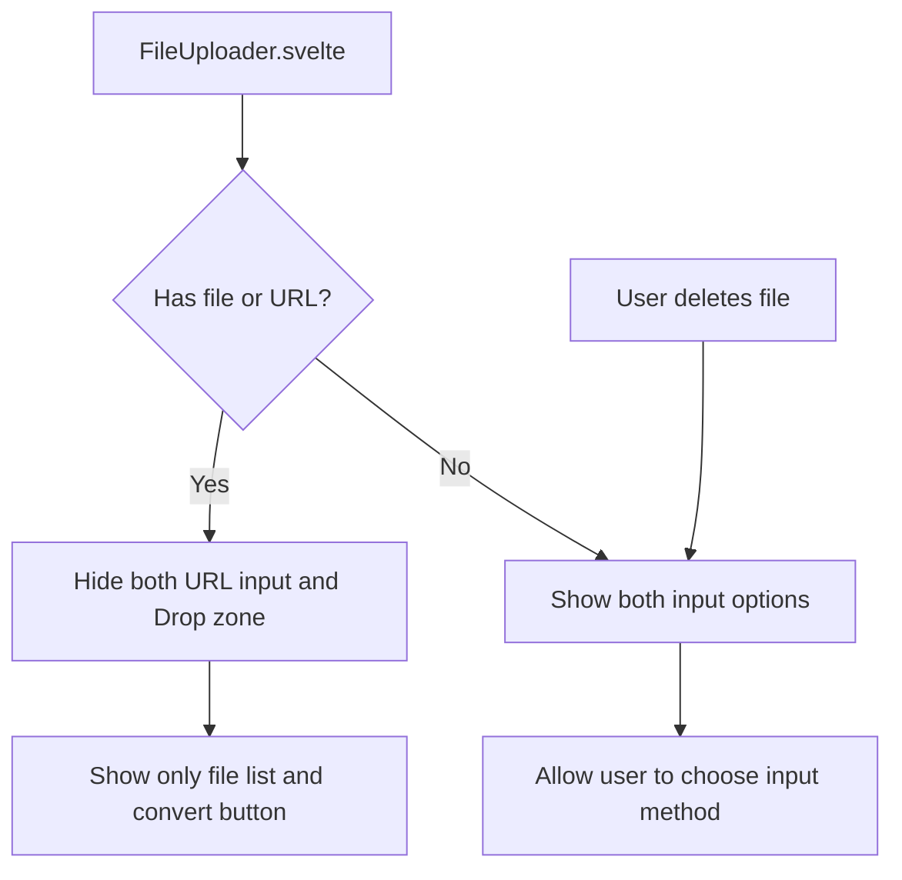
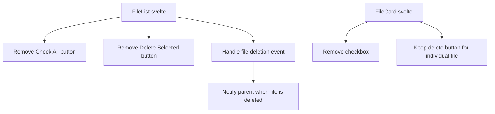
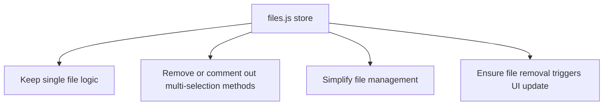

# UI Simplification Plan for Single File Conversion

## Current Understanding

The application currently has:
1. A file uploader component that already limits to one file at a time
2. A URL input section with tabs for different URL types
3. A file list component with checkboxes and batch selection functionality
4. Logic to disable URL input when a file is selected and vice versa

## Requested Changes

1. Hide both the URL input/tabs AND the drop zone once either a file or URL is added
2. Only show the file list and the convert button once an item is added
3. When the user deletes the file from the list, re-reveal both input options
4. Remove checkboxes and "check all" functionality from the file list since we can only have one document now

## Implementation Plan

### 1. Update FileUploader.svelte



We need to modify the FileUploader.svelte component to:
- Use a single reactive variable to track if any item (file or URL) is present
- Hide both the URL input/tabs AND the drop zone once an item is added
- Only show the file list and convert button when an item is present
- Show both input options when no item is present
- Re-reveal both input options when the file is deleted from the list

### 2. Update FileList.svelte and FileCard.svelte



We need to:
- Remove the "Check All" and "Delete Selected" buttons from FileList.svelte
- Remove the checkbox from FileCard.svelte
- Keep the delete button for removing individual files
- Ensure the file deletion event properly updates the UI state
- Make sure the parent component is notified when a file is deleted

### 3. Update Store Logic



We should:
- Keep the existing logic that replaces all files with just the new one
- Remove or comment out methods related to file selection (toggleSelect, selectAll)
- Update any store methods that assume multiple files might be present
- Ensure the file removal logic properly updates the store state

### 4. Update Documentation

- Update comments in affected files to reflect the simplified single-file approach
- Update the batch-converter-fix-plan.md to include these UI changes

## Code Changes

### 1. FileUploader.svelte Changes

```svelte
<!-- Update to hide both input methods when an item is present -->
<div class="file-uploader" in:fade={{ duration: 200 }}>
  <Container>
    <div class="uploader-content">
      <!-- Only show input options when no file/URL is present -->
      {#if !showFileList}
        <!-- URL Input Section -->
        <div class="section">
          <TabNavigation />
          <UrlInput />
        </div>
        
        <div class="section-divider"></div>

        <!-- File Upload Section -->
        <div class="section">
          <div class:disabled={fileUploaderDisabled}>
            <DropZone
              acceptedTypes={SUPPORTED_EXTENSIONS}
              on:filesDropped={(event) => !fileUploaderDisabled && handleFilesAdded(event.detail.files)}
              on:filesSelected={(event) => !fileUploaderDisabled && handleFilesAdded(event.detail.files)}
            />
          </div>
        </div>
      {/if}
      
      <!-- Error messages and file list always shown when needed -->
      {#if $uploadStore.message}
        <div class="section">
          <ErrorMessage />
        </div>
      {/if}

      {#if showFileList}
        <div class="section">
          <FileList on:fileRemoved={handleFileRemoved} />
        </div>
      {/if}

      {#if needsApiKey}
        <div class="section">
          <ApiKeyInput />
        </div>
      {/if}
    </div>
  </Container>
</div>

<script>
  // Add handler for file removal
  function handleFileRemoved() {
    // This will be called when a file is removed from the list
    // The reactive variable showFileList will automatically update
    // based on $files.length, which will re-reveal the input options
  }
</script>
```

### 2. FileList.svelte Changes

```svelte
<!-- Remove file list actions section with checkboxes -->
<script>
  import { createEventDispatcher } from 'svelte';
  const dispatch = createEventDispatcher();
  
  function handleRemove(event) {
    const { id } = event.detail;
    if (!id) return;

    const result = files.removeFile(id);
    if (result.success) {
      dispatch('fileRemoved', { id, file: result.file });
      if ($files.length === 0) {
        files.clearFiles();
      }
    } else {
      console.error('Error removing file:', result.message);
    }
  }
</script>

{#if hasFiles}
  <div class="file-list-container" in:slide>
    <div class="file-list">
      {#each $files as file (file.id)}
        <div 
          class="file-item"
          in:fade={{ duration: 200 }}
          out:fade={{ duration: 150 }}
        >
          <FileCard 
            {file}
            on:remove={handleRemove}
          />
        </div>
      {/each}
    </div>
  </div>
{:else}
  <div class="empty-state" in:fade>
    <p>No files added yet.</p>
  </div>
{/if}
```

### 3. FileCard.svelte Changes

```svelte
<!-- Remove checkbox from file card -->
<div class="file-card">
  <div class="file-info">
    <span class="icon" aria-hidden="true">
      {fileIcon}
    </span>
    <span class="file-name" title={file.name}>
      {file.name}
    </span>
  </div>

  <button 
    class="delete-button" 
    on:click={handleRemove}
    aria-label={`Remove ${file.name}`}
    title="Remove file"
  >
    🗑️
  </button>
</div>
```

## Implementation Steps

1. First, update the FileCard.svelte to remove the checkbox
2. Then update FileList.svelte to remove the selection actions and ensure it dispatches events when files are removed
3. Update FileUploader.svelte to:
   - Hide both input options once an item is added
   - Listen for fileRemoved events from FileList
   - Re-reveal both input options when the file list is empty
4. Simplify the files.js store methods if needed
5. Test all changes to ensure proper functionality, especially the re-revealing of input options when files are deleted
6. Update documentation to reflect the changes

## Additional Notes

- The reactive variable `showFileList` (based on `$files.length > 0`) will automatically handle showing/hiding the input options
- We need to ensure the file deletion properly triggers UI updates through the store
- The convert button should remain visible when an item is present
- We should ensure there's a clear way for users to remove the current item to start over