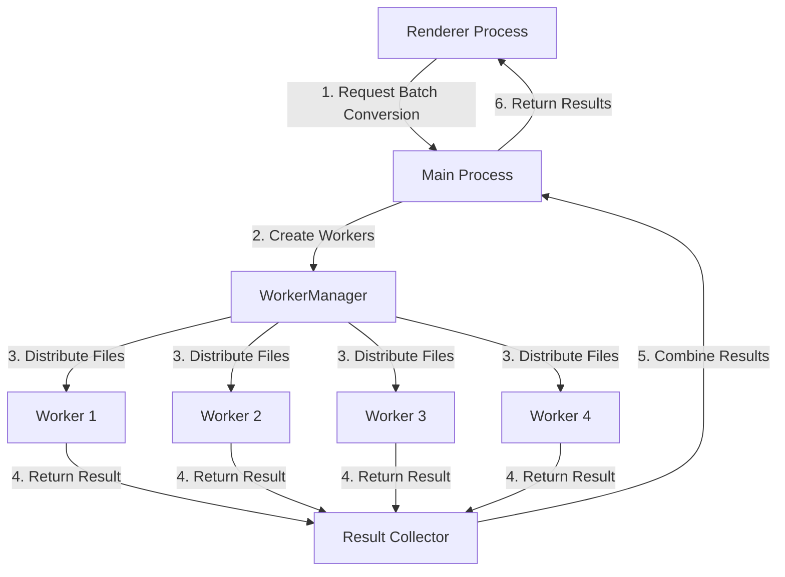

# Worker-Based Batch Conversion Implementation Plan

## Overview

This document outlines the implementation plan for replacing the current batch conversion system with a worker-based approach using Node.js child_process. This will solve the "An object could not be cloned" error that occurs during batch conversions while maintaining the same public API.



## New Files to Create

### 1. `src/electron/services/WorkerManager.js`

This service will handle creating, managing, and communicating with worker processes.

```javascript
/**
 * Worker Manager Service
 * 
 * Manages a pool of worker processes for file conversion tasks.
 * Creates and destroys workers as needed, distributes tasks, and collects results.
 * 
 * Related files:
 * - src/electron/workers/conversion-worker.js: Worker script
 * - src/electron/services/ElectronConversionService.js: Main conversion service
 * - src/electron/utils/serializationHelper.js: Serialization utilities
 */

const { fork } = require('child_process');
const path = require('path');
const { v4: uuidv4 } = require('uuid');
const SerializationHelper = require('../utils/serializationHelper');

class WorkerManager {
  constructor(options = {}) {
    this.maxWorkers = options.maxWorkers || 4;
    this.workerScript = options.workerScript || path.join(__dirname, '../workers/conversion-worker.js');
    this.serializationHelper = new SerializationHelper();
    this.activeWorkers = new Map();
    this.taskQueue = [];
    this.isProcessing = false;
  }

  /**
   * Process a batch of files using worker processes
   * @param {Array} items - Array of items to convert
   * @param {Object} options - Conversion options
   * @returns {Promise<Object>} - Batch conversion result
   */
  async processBatch(items, options = {}) {
    console.log(`🔄 [WorkerManager] Processing batch of ${items.length} items`);
    
    try {
      // Sanitize items to ensure they can be serialized
      const sanitizedItems = items.map(item => this.serializationHelper.sanitizeForSerialization(item));
      
      // Create a unique batch ID
      const batchId = uuidv4();
      
      // Create task objects
      const tasks = sanitizedItems.map((item, index) => ({
        id: item.id || `task-${index}`,
        batchId,
        item,
        options: this.serializationHelper.sanitizeForSerialization(options)
      }));
      
      // Process all tasks and collect results
      const results = await this._processTasks(tasks, options);
      
      // Combine and return results
      return {
        results,
        stats: {
          totalItems: items.length,
          successfulItems: results.filter(r => r.success).length,
          failedItems: results.filter(r => !r.success).length,
          duration: Date.now() - (this._batchStartTime || Date.now())
        }
      };
    } catch (error) {
      console.error(`❌ [WorkerManager] Batch processing error:`, error);
      throw error;
    }
  }

  /**
   * Process tasks using available workers
   * @param {Array} tasks - Array of tasks to process
   * @param {Object} options - Processing options
   * @returns {Promise<Array>} - Array of results
   * @private
   */
  async _processTasks(tasks, options = {}) {
    this._batchStartTime = Date.now();
    
    // Create a promise that will resolve when all tasks are complete
    return new Promise((resolve, reject) => {
      const results = new Array(tasks.length);
      let completedTasks = 0;
      
      // Function to check if all tasks are complete
      const checkCompletion = () => {
        if (completedTasks === tasks.length) {
          // Clean up workers
          this._cleanupWorkers();
          resolve(results);
        }
      };
      
      // Function to process a single task
      const processTask = async (taskIndex) => {
        const task = tasks[taskIndex];
        
        try {
          // Create a worker for this task
          const worker = this._createWorker();
          
          // Set up message handler
          worker.on('message', (message) => {
            if (message.type === 'result') {
              // Store the result
              results[taskIndex] = message.data;
              completedTasks++;
              
              // Terminate the worker
              worker.kill();
              
              // Check if all tasks are complete
              checkCompletion();
              
              // Process next task if available
              const nextTaskIndex = tasks.findIndex((_, i) => !results[i] && !this.activeWorkers.has(i));
              if (nextTaskIndex !== -1 && !this.activeWorkers.has(nextTaskIndex)) {
                processTask(nextTaskIndex);
              }
            } else if (message.type === 'progress') {
              // Forward progress updates
              if (options.onProgress) {
                options.onProgress({
                  id: task.id,
                  index: taskIndex,
                  progress: message.data.progress,
                  file: task.item.name
                });
              }
            } else if (message.type === 'error') {
              console.error(`❌ [WorkerManager] Worker error:`, message.data);
              
              // Store error result
              results[taskIndex] = {
                success: false,
                error: message.data.message || 'Unknown worker error',
                name: task.item.name,
                type: task.item.type,
                content: `# Conversion Error\n\nFailed to convert ${task.item.name}\nError: ${message.data.message || 'Unknown worker error'}`
              };
              
              completedTasks++;
              
              // Terminate the worker
              worker.kill();
              
              // Check if all tasks are complete
              checkCompletion();
              
              // Process next task if available
              const nextTaskIndex = tasks.findIndex((_, i) => !results[i] && !this.activeWorkers.has(i));
              if (nextTaskIndex !== -1 && !this.activeWorkers.has(nextTaskIndex)) {
                processTask(nextTaskIndex);
              }
            }
          });
          
          // Set up error handler
          worker.on('error', (error) => {
            console.error(`❌ [WorkerManager] Worker process error:`, error);
            
            // Store error result
            results[taskIndex] = {
              success: false,
              error: error.message || 'Worker process error',
              name: task.item.name,
              type: task.item.type,
              content: `# Conversion Error\n\nFailed to convert ${task.item.name}\nError: ${error.message || 'Worker process error'}`
            };
            
            completedTasks++;
            
            // Check if all tasks are complete
            checkCompletion();
            
            // Process next task if available
            const nextTaskIndex = tasks.findIndex((_, i) => !results[i] && !this.activeWorkers.has(i));
            if (nextTaskIndex !== -1 && !this.activeWorkers.has(nextTaskIndex)) {
              processTask(nextTaskIndex);
            }
          });
          
          // Set up exit handler
          worker.on('exit', (code) => {
            this.activeWorkers.delete(taskIndex);
            
            if (code !== 0 && !results[taskIndex]) {
              // Store error result if not already stored
              results[taskIndex] = {
                success: false,
                error: `Worker exited with code ${code}`,
                name: task.item.name,
                type: task.item.type,
                content: `# Conversion Error\n\nFailed to convert ${task.item.name}\nError: Worker exited with code ${code}`
              };
              
              completedTasks++;
              
              // Check if all tasks are complete
              checkCompletion();
            }
          });
          
          // Store worker reference
          this.activeWorkers.set(taskIndex, worker);
          
          // Send task to worker
          worker.send({
            type: 'convert',
            data: task
          });
        } catch (error) {
          console.error(`❌ [WorkerManager] Error processing task:`, error);
          
          // Store error result
          results[taskIndex] = {
            success: false,
            error: error.message || 'Error processing task',
            name: task.item.name,
            type: task.item.type,
            content: `# Conversion Error\n\nFailed to convert ${task.item.name}\nError: ${error.message || 'Error processing task'}`
          };
          
          completedTasks++;
          
          // Check if all tasks are complete
          checkCompletion();
          
          // Process next task if available
          const nextTaskIndex = tasks.findIndex((_, i) => !results[i] && !this.activeWorkers.has(i));
          if (nextTaskIndex !== -1 && !this.activeWorkers.has(nextTaskIndex)) {
            processTask(nextTaskIndex);
          }
        }
      };
      
      // Start processing tasks up to maxWorkers
      const initialBatch = Math.min(tasks.length, this.maxWorkers);
      for (let i = 0; i < initialBatch; i++) {
        processTask(i);
      }
    });
  }

  /**
   * Create a new worker process
   * @returns {ChildProcess} - Worker process
   * @private
   */
  _createWorker() {
    console.log(`🔄 [WorkerManager] Creating new worker process`);
    
    const worker = fork(this.workerScript, [], {
      stdio: ['pipe', 'pipe', 'pipe', 'ipc'],
      env: {
        ...process.env,
        WORKER_PROCESS: 'true'
      }
    });
    
    return worker;
  }

  /**
   * Clean up all active workers
   * @private
   */
  _cleanupWorkers() {
    console.log(`🧹 [WorkerManager] Cleaning up ${this.activeWorkers.size} workers`);
    
    for (const worker of this.activeWorkers.values()) {
      try {
        worker.kill();
      } catch (error) {
        console.error(`❌ [WorkerManager] Error killing worker:`, error);
      }
    }
    
    this.activeWorkers.clear();
  }
}

module.exports = WorkerManager;
```

### 2. `src/electron/workers/conversion-worker.js`

This is the worker script that will run in a separate process and handle individual file conversions.

```javascript
/**
 * Conversion Worker
 * 
 * Worker process for handling file conversions in isolation.
 * Receives conversion tasks via IPC, processes them, and returns results.
 * 
 * Related files:
 * - src/electron/services/WorkerManager.js: Worker manager
 * - backend/src/services/ConversionService.js: Core conversion logic
 * - src/electron/utils/serializationHelper.js: Serialization utilities
 */

const path = require('path');
const SerializationHelper = require('../utils/serializationHelper');

// Initialize serialization helper
const serializationHelper = new SerializationHelper();

// Flag to indicate this is a worker process
process.env.IS_WORKER = 'true';

// Set up error handling
process.on('uncaughtException', (error) => {
  console.error(`❌ [Worker] Uncaught exception:`, error);
  
  // Send error to parent process
  process.send({
    type: 'error',
    data: {
      message: error.message,
      stack: error.stack
    }
  });
  
  // Exit with error code
  process.exit(1);
});

// Listen for messages from parent process
process.on('message', async (message) => {
  if (message.type === 'convert') {
    await handleConversion(message.data);
  }
});

/**
 * Handle a conversion task
 * @param {Object} task - Conversion task
 */
async function handleConversion(task) {
  console.log(`🔄 [Worker] Processing task: ${task.id}`);
  
  try {
    // Import the ConversionService dynamically
    const { ConversionService } = await import('../../../backend/src/services/ConversionService.js');
    
    // Create a new instance of the ConversionService
    const conversionService = new ConversionService();
    
    // Set up progress tracking
    const onProgress = (progress) => {
      // Send progress update to parent process
      process.send({
        type: 'progress',
        data: {
          taskId: task.id,
          progress
        }
      });
    };
    
    // Add progress tracking to options
    const options = {
      ...task.options,
      onProgress
    };
    
    // Process the item
    const result = await conversionService.processItem({
      ...task.item,
      options
    });
    
    // Sanitize the result to ensure it can be serialized
    const sanitizedResult = serializationHelper.sanitizeForSerialization(result);
    
    // Send result to parent process
    process.send({
      type: 'result',
      data: sanitizedResult
    });
    
    console.log(`✅ [Worker] Task completed: ${task.id}`);
  } catch (error) {
    console.error(`❌ [Worker] Error processing task:`, error);
    
    // Send error to parent process
    process.send({
      type: 'error',
      data: {
        message: error.message,
        stack: error.stack,
        taskId: task.id
      }
    });
  }
}

// Signal that the worker is ready
console.log(`🚀 [Worker] Conversion worker started (PID: ${process.pid})`);
```

### 3. `src/electron/utils/serializationHelper.js`

This utility will handle sanitizing objects to ensure they can be serialized for IPC communication.

```javascript
/**
 * Serialization Helper
 * 
 * Utilities for ensuring objects can be safely serialized for IPC communication.
 * Handles sanitizing objects, removing non-serializable properties, and validating serialization.
 * 
 * Related files:
 * - src/electron/services/WorkerManager.js: Uses this for worker communication
 * - src/electron/workers/conversion-worker.js: Uses this for result sanitization
 */

class SerializationHelper {
  /**
   * Sanitize an object for serialization
   * @param {*} obj - Object to sanitize
   * @param {Set} [seen] - Set of already seen objects (for circular reference detection)
   * @returns {*} - Sanitized object
   */
  sanitizeForSerialization(obj, seen = new Set()) {
    // Handle null/undefined
    if (obj === null || obj === undefined) {
      return obj;
    }
    
    // Handle primitives
    if (typeof obj !== 'object' && typeof obj !== 'function') {
      return obj;
    }
    
    // Handle functions
    if (typeof obj === 'function') {
      return undefined; // Remove functions
    }
    
    // Handle Date objects
    if (obj instanceof Date) {
      return obj.toISOString();
    }
    
    // Handle Buffer objects
    if (Buffer.isBuffer(obj)) {
      return {
        type: 'Buffer',
        data: Array.from(obj)
      };
    }
    
    // Handle arrays
    if (Array.isArray(obj)) {
      // Check for circular references
      if (seen.has(obj)) {
        return '[Circular Reference]';
      }
      
      // Add to seen objects
      seen.add(obj);
      
      // Sanitize array elements
      return obj.map(item => this.sanitizeForSerialization(item, seen));
    }
    
    // Handle objects
    // Check for circular references
    if (seen.has(obj)) {
      return '[Circular Reference]';
    }
    
    // Add to seen objects
    seen.add(obj);
    
    // Create a new object with sanitized properties
    const sanitized = {};
    
    for (const [key, value] of Object.entries(obj)) {
      // Skip functions and properties that start with underscore
      if (typeof value === 'function' || key.startsWith('_')) {
        continue;
      }
      
      // Sanitize the value
      sanitized[key] = this.sanitizeForSerialization(value, seen);
    }
    
    return sanitized;
  }

  /**
   * Check if an object can be cloned (serialized)
   * @param {*} obj - Object to check
   * @returns {boolean} - Whether the object can be cloned
   */
  canBeCloned(obj) {
    try {
      // Try to stringify the object
      JSON.stringify(obj);
      return true;
    } catch (error) {
      return false;
    }
  }

  /**
   * Reconstruct a Buffer from its serialized form
   * @param {Object} obj - Serialized Buffer object
   * @returns {Buffer} - Reconstructed Buffer
   */
  reconstructBuffer(obj) {
    if (obj && obj.type === 'Buffer' && Array.isArray(obj.data)) {
      return Buffer.from(obj.data);
    }
    return obj;
  }
}

module.exports = SerializationHelper;
```

## Modifications to Existing Files

### 1. `src/electron/services/ElectronConversionService.js`

Update the `convertBatch` method to use the new WorkerManager.

```javascript
// Add this import at the top of the file
const WorkerManager = require('./WorkerManager');

// Replace the convertBatch method with this implementation
/**
 * Convert multiple files in batch using worker processes
 * @param {Array<string>} paths - Array of file paths to convert
 * @param {Object} options - Conversion options
 * @returns {Promise<Object>} - Batch conversion result
 */
async convertBatch(paths, options = {}) {
  console.log(`🔄 Starting batch conversion of ${paths.length} files`);
  
  if (!Array.isArray(paths) || paths.length === 0) {
    throw new Error('No files provided for batch conversion');
  }
  
  const batchStartTime = Date.now();
  const batchOutputPath = this._generateBatchOutputPath();
  let batchResult;
  
  try {
    // Create batch output directory
    await this.fileSystem.createDirectory(batchOutputPath);
    
    // Prepare items for conversion
    const items = await this._prepareBatchItems(paths, options);
    
    // Filter out invalid items
    const validItems = items.filter(item => item && item.content);
    
    if (validItems.length === 0) {
      throw new Error('No valid files to convert');
    }
    
    console.log(`🔄 Batch conversion: ${validItems.length} valid items, ${items.length - validItems.length} failed preparation`);
    
    // Create worker manager
    const workerManager = new WorkerManager({
      maxWorkers: 4 // Maximum of 4 workers as specified
    });
    
    // Process batch using worker manager
    batchResult = await workerManager.processBatch(validItems, {
      ...options,
      onProgress: options.onProgress
    });
    
    // Process the results and write files to the batch output directory
    if (batchResult.results && batchResult.results.length > 0) {
      console.log(`📁 Writing ${batchResult.results.length} files to batch output directory`);
      
      for (const result of batchResult.results) {
        try {
          if (!result || !result.content) continue;
          
          const category = result.category || 'unknown';
          const categoryDir = path.join(batchOutputPath, category);
          
          // Create category directory if it doesn't exist
          await this.fileSystem.createDirectory(categoryDir);
          
          // Generate filename
          const baseName = path.basename(result.name, path.extname(result.name));
          const outputFile = path.join(categoryDir, `${baseName}.md`);
          
          // Write the file
          await this.fileSystem.writeFile(outputFile, result.content);
          console.log(`✅ Wrote file: ${outputFile}`);
        } catch (fileError) {
          console.error(`❌ Error writing result file:`, {
            name: result.name,
            error: fileError.message
          });
        }
      }
      
      // Write batch summary
      await this._writeBatchSummary(batchOutputPath, batchResult, batchStartTime);
    }
    
    console.log(`✅ Batch conversion completed in ${Date.now() - batchStartTime}ms:`, {
      totalItems: paths.length,
      successfulItems: batchResult.stats.successfulItems,
      failedItems: batchResult.stats.failedItems,
      outputPath: batchOutputPath
    });
    
    return {
      success: true,
      outputDir: batchOutputPath,
      results: batchResult.results,
      stats: batchResult.stats
    };
  } catch (error) {
    console.error(`❌ Batch conversion error:`, error);
    
    return {
      success: false,
      error: error.message,
      outputDir: batchOutputPath
    };
  }
}
```

### 2. `src/electron/adapters/conversionServiceAdapter.js`

Update the `convertBatch` method to handle serialization properly.

```javascript
// Add this import at the top of the file
const SerializationHelper = require('../utils/serializationHelper');

// Add this as a class property in the constructor
this.serializationHelper = new SerializationHelper();

// Replace the convertBatch method with this implementation
/**
 * Convert multiple items in batch
 * @param {Array<Object>} items - Array of items to convert
 * @returns {Promise<Object>} Batch conversion result
 */
async convertBatch(items) {
  console.log(`🔄 [ConversionServiceAdapter] Converting batch of ${items.length} items`);
  
  try {
    // Sanitize items to ensure they can be serialized
    const sanitizedItems = items.map(item => this.serializationHelper.sanitizeForSerialization(item));
    
    // Create a new instance of the ConversionService class
    const ConversionServiceClass = await this.executeMethodFromExport('ConversionService', []);
    const conversionService = new ConversionServiceClass();
    
    // Call the convertBatch method
    const result = await conversionService.convertBatch(sanitizedItems);
    
    // Sanitize the result to ensure it can be serialized
    const sanitizedResult = this.serializationHelper.sanitizeForSerialization(result);
    
    return sanitizedResult;
  } catch (error) {
    console.error(`❌ [ConversionServiceAdapter] Batch conversion error:`, error);
    throw error;
  }
}
```

## Implementation Steps

### Phase 1: Serialization Layer

1. Create the `src/electron/utils/serializationHelper.js` file
2. Update `src/electron/adapters/conversionServiceAdapter.js` to use the serialization helper
3. Test basic serialization with the existing batch conversion flow

### Phase 2: Worker Infrastructure

1. Create the `src/electron/workers/conversion-worker.js` file
2. Create the `src/electron/services/WorkerManager.js` file
3. Update `src/electron/services/ElectronConversionService.js` to use the worker manager

### Phase 3: Testing and Refinement

1. Test the worker-based batch conversion with various file types
2. Monitor memory usage and performance
3. Refine error handling and progress reporting
4. Add comprehensive logging for debugging

## Benefits of This Approach

1. **Isolation**: Each file conversion runs in its own process, preventing cross-contamination
2. **Parallelism**: Multiple files can be processed simultaneously (up to 4 workers)
3. **Reliability**: Failures in one conversion won't affect others
4. **Clean State**: Workers are created/destroyed for each batch, ensuring a clean environment
5. **Serialization Safety**: The SerializationHelper ensures all objects can be safely passed between processes

## Potential Challenges

1. **Process Overhead**: Creating and destroying worker processes adds some overhead
2. **Memory Usage**: Running multiple Node.js processes consumes more memory
3. **Debugging Complexity**: Debugging across multiple processes can be more challenging
4. **Error Handling**: Ensuring proper error propagation from workers to the main process

## Next Steps

After implementing this solution, we should:

1. Add comprehensive logging to monitor worker performance
2. Create automated tests for the worker-based conversion
3. Consider adding a configuration option to adjust the maximum number of workers
4. Monitor memory usage in production to ensure it stays within acceptable limits