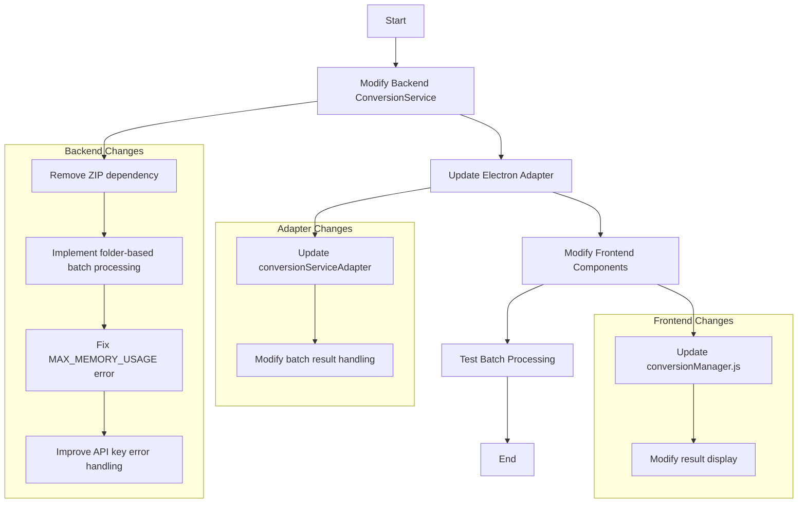

# Batch Processing Improvement Plan

## Overview

This document outlines the plan to replace the ZIP-based batch processing functionality with a simpler folder-based approach. The current implementation has issues with the `MAX_MEMORY_USAGE` constant not being defined and attempts to create ZIP archives that are no longer needed.

## Current Issues

1. **ZIP Functionality Issues**:
   - The `createBatchZip` function in `zipProcessor.js` is causing errors
   - The `MAX_MEMORY_USAGE` constant is referenced but not defined
   - ZIP creation is adding unnecessary complexity and memory usage

2. **API Key Requirement Errors**:
   - Files requiring API keys (mp3, mp4) are failing with unhelpful error messages
   - These errors should be handled more gracefully with better user feedback

3. **Batch Processing Flow**:
   - Currently, the batch processing tries to create a ZIP archive of all converted files
   - We need to modify this to save individual files to a batch folder instead

## Implementation Plan

## 1. Modify Backend Conversion Service

### 1.1. Update ConversionService.js
- Remove the import for `createBatchZip` from zipProcessor.js
- Remove code that generates the summary.md file
- Modify the `convertBatch` method to save files directly to folders instead of creating a ZIP
- Define the missing `MAX_MEMORY_USAGE` constant
- Implement folder-based batch processing with proper category organization
- Improve API key validation with clearer error messages

### 1.2. Specific Code Changes
- Add memory usage constant: `const MAX_MEMORY_USAGE = 512 * 1024 * 1024; // 512MB memory threshold`
- Modify the `convertBatch` method to:
  - Create a batch folder
  - Process each item and save it directly to the appropriate subfolder based on category
  - Return the folder path instead of a ZIP buffer
- Enhance API key validation to check requirements before processing starts
- Remove all ZIP-related code and the summary.md generation

## 2. Update Electron Adapter

### 2.1. Update conversionServiceAdapter.js
- Modify the `convertBatch` method to handle folder-based results
- Update the result structure to include folder path and file list
- Ensure proper error handling for API key requirements

### 2.2. Specific Code Changes
- Update the return value of `convertBatch` to include the output folder path
- Remove any ZIP-specific handling code
- Ensure API key errors are properly propagated to the UI

## 3. Modify Frontend Components

### 3.1. Update conversionManager.js
- Modify the batch conversion handling to work with folder output instead of ZIP files
- Update the result handling to point to the batch folder
- Improve error handling for API key requirements
- Remove any code related to summary.md

### 3.2. Specific Code Changes
- Update the `handleElectronConversion` function to handle folder-based results
- Remove any ZIP-specific code
- Ensure proper error handling for API key requirements

## 4. Testing Strategy

### 4.1. Test Cases
- Test batch conversion with different file types
- Verify API key error handling for audio/video files
- Ensure folder structure is created correctly
- Validate that all files are saved properly
- Test with large batches to ensure memory efficiency

### 4.2. Verification Steps
- Verify that the MAX_MEMORY_USAGE error is resolved
- Confirm that API key errors are handled gracefully with clear messages
- Ensure that all files are properly saved to the batch folder
- Verify that the batch folder structure is organized by file category

## 5. Implementation Approach

The implementation will follow these steps:

1. First, modify the backend ConversionService.js to implement folder-based batch processing
2. Update the conversionServiceAdapter.js to handle the new result format
3. Modify the frontend conversionManager.js to work with folder-based results
4. Test the changes with various file types and batch sizes
5. Verify that all error conditions are handled properly

## 6. Benefits of This Approach

1. **Simplicity**: Folder-based approach is simpler and more reliable than ZIP creation
2. **Memory Efficiency**: Avoids memory issues associated with creating large ZIP archives
3. **Better User Experience**: Files are immediately accessible without needing to extract a ZIP
4. **Improved Error Handling**: Clearer error messages for API key requirements
5. **Maintainability**: Simpler code is easier to maintain and extend