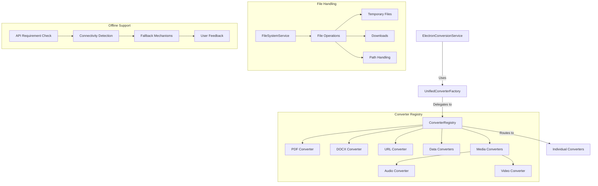
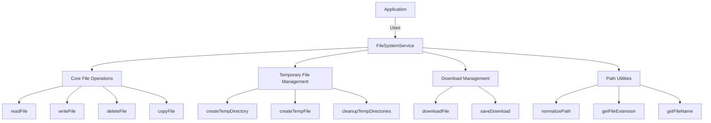

# Phase 6: Update Documentation

## Overall Goal

Update system documentation to reflect the streamlined architecture and provide guidance for future development. This phase ensures that all changes made during the streamlining process are properly documented, making the codebase more maintainable and easier for new developers to understand.

## Files to Change/Delete

### Files to Modify:
- `cline_docs/systemPatterns.md`
- `cline_docs/progress.md`
- `cline_docs/activeContext.md`
- `cline_docs/techContext.md` (if needed)
- Any README files or developer documentation

## Step-by-Step Process

### 1. Update Architecture Documentation

Update `systemPatterns.md` to reflect the streamlined architecture:

#### Actions:
1. Review the current architecture documentation in `systemPatterns.md`
2. Update sections that describe components or utilities that have been removed or consolidated
3. Add new sections describing the streamlined architecture
4. Update flowcharts and diagrams to reflect the current state

```markdown
## Layered Converter Architecture

The application implements a streamlined layered converter architecture to handle file conversions in a standardized, maintainable way.



#### Implementation Details
- **Consolidated File Handling**: All file operations now use the centralized `FileSystemService`
- **Streamlined PDF Converters**: Clear separation between standard and OCR conversion
- **Simplified Offline Support**: Focused on API-dependent converters with clear user feedback
- **Removed Legacy Components**: Eliminated unused components and utilities
```

4. Document the consolidated file handling approach
5. Clarify the PDF converter architecture
6. Explain the simplified offline support mechanism
7. Document any changes to the component structure

### 2. Document Removed Components

Create a section in documentation listing removed components and the rationale for their removal:

#### Actions:
1. Create a new section in `systemPatterns.md` or a separate document
2. List all components, utilities, and stores that were removed
3. Explain why each was removed
4. Document any replacement functionality

```markdown
## Removed Components and Utilities

During the streamlining process, several unused or redundant components and utilities were removed:

### UI Components
- **ProfessorSynapseAd.svelte**: Removed as this promotional component was no longer used in the application.
- **OcrSettings.svelte**: Removed as OCR settings are now integrated directly into the PDF conversion options.

### Utilities
- **legacyConverter.js**: Removed as it was replaced by the new converter architecture.
- **oldFileHandler.js**: Functionality consolidated into FileSystemService.

### Stores
- **adStore.js**: Removed as it was only used by the now-removed ProfessorSynapseAd component.

### Deprecated Functions
- **extractImagesWithFallback()**: Removed commented-out code from StandardPdfConverter as image extraction is now handled by MistralPdfConverter.
```

5. Provide guidance for any functionality that might be needed in the future
6. Document any migration paths for deprecated functionality

### 3. Update Progress Document

Add entries to `progress.md` for completed streamlining tasks:

#### Actions:
1. Add a new section to `progress.md` for the streamlining effort
2. Document each phase of the streamlining process
3. Mark items as completed
4. Add new items for future improvements

```markdown
## Current Status

- **Completed**: Codebase Streamlining
  - Removed unused components (ProfessorSynapseAd, OcrSettings)
  - Consolidated file handling utilities into FileSystemService
  - Optimized PDF converters for better separation of concerns
  - Simplified offline support to focus on API-dependent converters
  - Cleaned up legacy code and removed redundant utilities
  - Updated documentation to reflect streamlined architecture

## Known Issues
- ~~URL conversion failures due to converter registration issues~~ (Fixed)
- ~~Asset loading failures in Windows production builds~~ (Fixed)
- ~~File locking issues with logo.png during Windows builds~~ (Fixed)
- ~~File locking issues with favicon.png during Windows builds~~ (Fixed)
- ~~EBUSY errors during electron-builder packaging~~ (Fixed)
- ~~SvelteKit asset loading failures in installed application~~ (Fixed)
- ~~Navigation bar missing in final Electron build~~ (Fixed)
- ~~URL conversion failing with "converter.convert is not a function" error~~ (Fixed)
- ~~Advanced OCR not being used despite OCR being enabled and Mistral API key being present~~ (Fixed)
- ~~MP3 conversion failing with "fileType is not defined" error~~ (Fixed)
- ~~Video conversion failing with "PathUtils.resolvePath is not a function" error~~ (Fixed)
- ~~Video conversion failing with "PathUtils.toPlatformPath is not a function" error~~ (Fixed)
- ~~Redundant file handling utilities causing maintenance issues~~ (Fixed)
- ~~Unused components increasing bundle size~~ (Fixed)
- ~~Complex offline support mechanism~~ (Simplified)
- Some static assets may not be properly loaded in certain edge cases
- Error handling could be improved for better user feedback
- Need to ensure proper cleanup of resources when the app is closed

## Next Steps

### Short-term Actions
1. ~~Complete codebase streamlining~~ (Done)
2. Implement automated tests for critical functionality
3. Enhance error handling for better user feedback
4. Improve resource cleanup on application close
```

4. Update the "Known Issues" section to reflect fixed issues
5. Add new "Next Steps" based on findings during the streamlining process

### 4. Create Migration Guide

Document how to migrate from deprecated utilities to the new consolidated approach:

#### Actions:
1. Create a migration guide for developers
2. Provide examples of using the consolidated functions
3. Include before/after code samples
4. Document best practices for the streamlined architecture

```markdown
## Migration Guide

### Migrating from Legacy File Utilities

#### Before (using old utilities):
```javascript
import { readFile, writeFile } from '../utils/filehandler';
import { createTempFile } from '../utils/conversion/handlers/tempFileManager';

async function processFile(path) {
  const content = await readFile(path);
  const tempPath = await createTempFile(content);
  // Process the file
  const result = await processContent(content);
  await writeFile(path, result);
}
```

#### After (using FileSystemService):
```javascript
import { FileSystemService } from '../services/FileSystemService';
const fileSystemService = FileSystemService.getInstance();

async function processFile(path) {
  const content = await fileSystemService.readFile(path);
  const tempPath = await fileSystemService.createTempFile(content);
  // Process the file
  const result = await processContent(content);
  await fileSystemService.writeFile(path, result);
}
```

### Migrating to Simplified Offline Support

#### Before:
```javascript
import { isOnline, queueOfflineOperation } from '../services/offlineApi';

async function convertFile(file, options) {
  // Check online status for all conversions
  if (!await isOnline()) {
    return queueOfflineOperation(() => convertFile(file, options));
  }
  
  // Proceed with conversion
  return converter.convert(file.content, file.name, options.apiKey, options);
}
```

#### After:
```javascript
import { checkOnlineStatus } from '../services/offlineApi';

async function convertFile(file, options) {
  const converter = getConverterForFile(file);
  
  // Only check online status if the converter requires API access
  if (converter.config.requiresApi || (file.type === 'pdf' && options.useOcr)) {
    const isOnline = await checkOnlineStatus();
    
    if (!isOnline) {
      // Handle offline scenario with clear user feedback
      return handleOfflineConversion(file, options);
    }
  }
  
  // Proceed with conversion
  return converter.convert(file.content, file.name, options.apiKey, options);
}
```
```

5. Include guidance on best practices for:
   - File handling
   - PDF conversion
   - Offline support
   - Component structure
   - Store usage

### 5. Update Architecture Diagrams

Create new diagrams showing the streamlined architecture:

#### Actions:
1. Update existing diagrams in `systemPatterns.md`
2. Create new diagrams for:
   - Consolidated file handling
   - Streamlined PDF converter architecture
   - Simplified offline support
   - Updated component structure
3. Ensure diagrams accurately represent the current state
4. Add explanatory text for each diagram

```markdown
## Streamlined File Handling Architecture



4. Use consistent styling and notation across all diagrams
5. Ensure diagrams are accessible and easy to understand

### 6. Add Future Recommendations

Document recommendations for future improvements:

#### Actions:
1. Create a section for future recommendations
2. Identify areas that could benefit from further streamlining
3. Suggest potential enhancements
4. Prioritize recommendations based on impact and effort

```markdown
## Future Recommendations

Based on the streamlining process, we recommend the following future improvements:

### High Priority
1. **Implement Comprehensive Test Suite**: Add unit and integration tests for all core functionality to prevent regressions during future development.
2. **Complete SvelteKit to Plain Svelte Migration**: As mentioned in the long-term strategy, completing this migration would resolve many asset loading and file locking issues.
3. **Enhance Error Handling**: Implement a more robust error handling system with clear user feedback and recovery options.

### Medium Priority
1. **Refactor Converter Registry**: Further simplify the converter registration process to make adding new converters even easier.
2. **Optimize Bundle Size**: Analyze and optimize the application bundle size to improve load times.
3. **Improve Resource Management**: Implement more robust resource cleanup to prevent memory leaks.

### Low Priority
1. **Modernize UI Components**: Update UI components to use more modern patterns and improve accessibility.
2. **Enhance Documentation**: Add more code examples and tutorials for common development tasks.
3. **Performance Profiling**: Conduct detailed performance profiling to identify bottlenecks.
```

5. Include estimated effort and impact for each recommendation
6. Provide guidance on implementation approaches

### 7. Update Technical Context

Update `techContext.md` if needed to reflect any changes to the technical architecture:

#### Actions:
1. Review `techContext.md` for any outdated information
2. Update sections that describe components or utilities that have been removed
3. Add new sections describing new technical patterns
4. Ensure consistency with other documentation

## Risk Mitigation

To ensure documentation accuracy:

1. **Review Changes**: Have team members review documentation changes for accuracy
2. **Cross-Reference**: Ensure consistency across all documentation files
3. **Code Examples**: Test all code examples to ensure they work as expected
4. **Diagrams**: Verify diagrams accurately represent the current architecture
5. **Future-Proofing**: Design documentation to be easily updatable as the codebase evolves

## Success Criteria

- Documentation accurately reflects the streamlined architecture
- Removed components and utilities are clearly documented
- Migration guidance is provided for deprecated functionality
- Diagrams are updated to reflect the current state
- Future recommendations are documented with clear priorities
- All documentation is consistent and up-to-date
- New developers can understand the architecture from the documentation