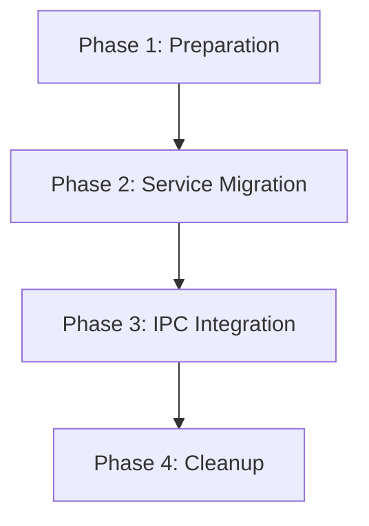
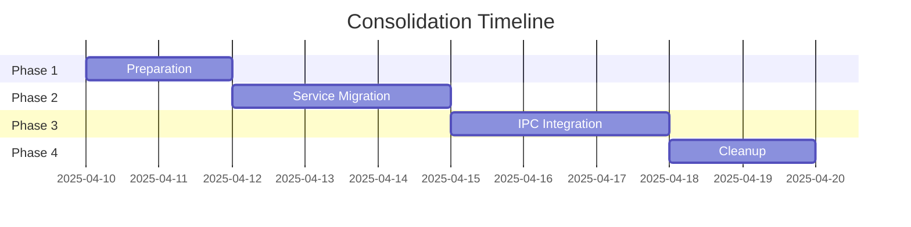
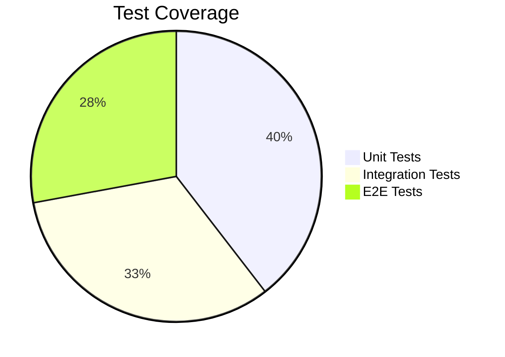

# Progress Status

## What Works
- Core application functionality
- File conversion for supported types
- Frontend UI and user interactions
- Basic IPC communication
- File system operations
- Build process (with some issues)
- Testing infrastructure

## Current Work
Planning and implementing backend consolidation into Electron main process:
- [x] Created consolidation plan
- [x] Created phase documentation
- [x] Created tracking mechanisms
- [ ] Begin Phase 1 implementation

### Consolidation Plan Structure

## What's Left to Build

### Phase 1: Preparation (1-2 days)
- [ ] Create service inventory
- [ ] Map all dependencies
- [ ] Create new directory structure
- [ ] Update package.json

### Phase 2: Service Migration (2-3 days)
- [ ] Move converters to Electron
- [ ] Move audio/video services
- [ ] Update service references
- [ ] Standardize on CommonJS

### Phase 3: IPC Integration (2-3 days)
- [ ] Create IPC type definitions
- [ ] Create handler registry
- [ ] Implement specific handlers
- [ ] Update main process
- [ ] Update frontend integration
- [ ] Implement security hardening

### Phase 4: Cleanup (1-2 days)
- [ ] Remove backend directory
- [x] Update project configuration
- [x] Update documentation
- [x] Fix NSIS memory mapping error
- [x] Fix NSIS icon format error
- [ ] Clean up code
- [ ] Run final verification

## Known Issues

### Active Issues
1. ESM vs CommonJS module system conflicts:
   - Causing production issues
   - Affects URL conversion particularly
   - Being addressed by consolidation plan

2. Complex three-component architecture:
   - Frontend, Backend, Electron separation causing issues
   - Will be simplified to two components
   - Migration plan in place

3. Duplicate code and utilities:
   - Found across components
   - Will be consolidated during migration
   - Single source of truth being established

4. File locking issues during builds:
   - Affects Windows particularly
   - Build process improvements planned
   - Will be simplified after consolidation

### Resolved Issues
- ~~Navigation bar missing in final build~~ (Fixed)
- ~~Asset loading issues~~ (Fixed)
- ~~PDF conversion errors~~ (Fixed)
- ~~Performance issues with large files~~ (Fixed)
- ~~UI responsiveness during conversion~~ (Fixed)
- ~~NSIS memory mapping error during Windows installer creation~~ (Fixed)
- ~~NSIS icon format error during Windows installer creation~~ (Fixed)
- ~~CSV converter initialization failure in production build~~ (Fixed)
- ~~Converter initialization failure due to missing node-cache dependency~~ (Fixed)
- ~~Multiple dependency-related failures in production build~~ (Fixed - moved axios, axios-retry, canvas, formdata-node, and tmp-promise to runtime dependencies)
- ~~False positive dependency warnings for built-in Node.js modules~~ (Fixed - enhanced verification script)

## Next Major Features
1. Consolidated Architecture:
   - Clean IPC interface
   - Type-safe communication
   - Improved error handling
   - Better performance monitoring

2. Improved Build Process:
   - Faster builds
   - Better error reporting
   - More reliable asset handling
   - Simplified configuration

3. Enhanced Testing:
   - Expanded test coverage
   - Performance benchmarks
   - Security validation
   - End-to-end scenarios

## Timeline

## Testing Status

### Current Coverage

### Planned Improvements
- New IPC communication tests
- Updated conversion flow tests
- Security validation tests
- Performance benchmark tests

## Documentation Status

### Completed
- Consolidation plan
- Phase implementation details
- Status tracking system
- Architecture overview
- Build optimization documentation (BUILD-OPTIMIZATION.md)

### In Progress
- API documentation updates
- Development setup guide
- Testing documentation
- Contribution guidelines

## Dependencies to Review
- Backend dependencies to merge
- Potential version conflicts
- Development tools alignment
- Testing framework updates

## Build Process Goals
- Simplified build pipeline
- Faster build times
- More reliable asset handling
- Better error reporting
- Cross-platform consistency
- Optimized installer creation
- Reduced package size

Remember: The consolidation effort is our current priority. All other feature work is on hold until this is complete.
