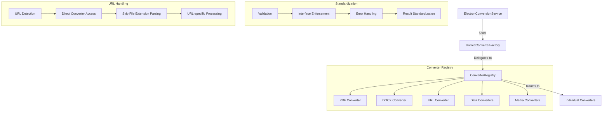
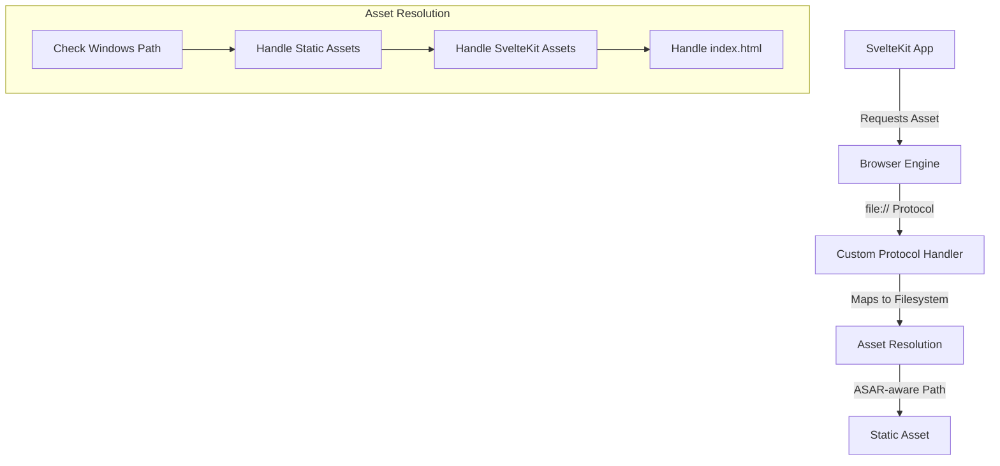
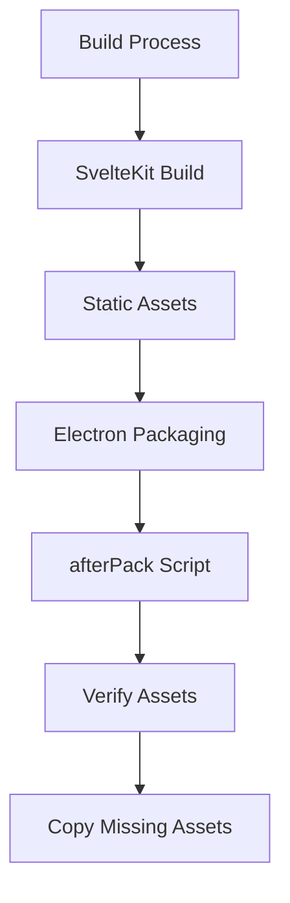
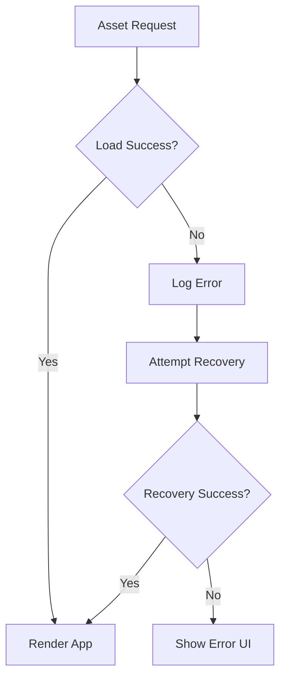
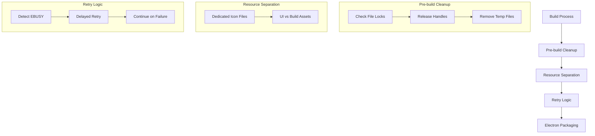
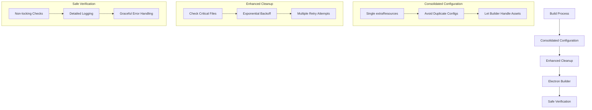
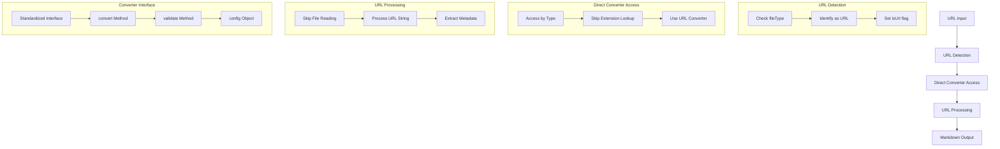
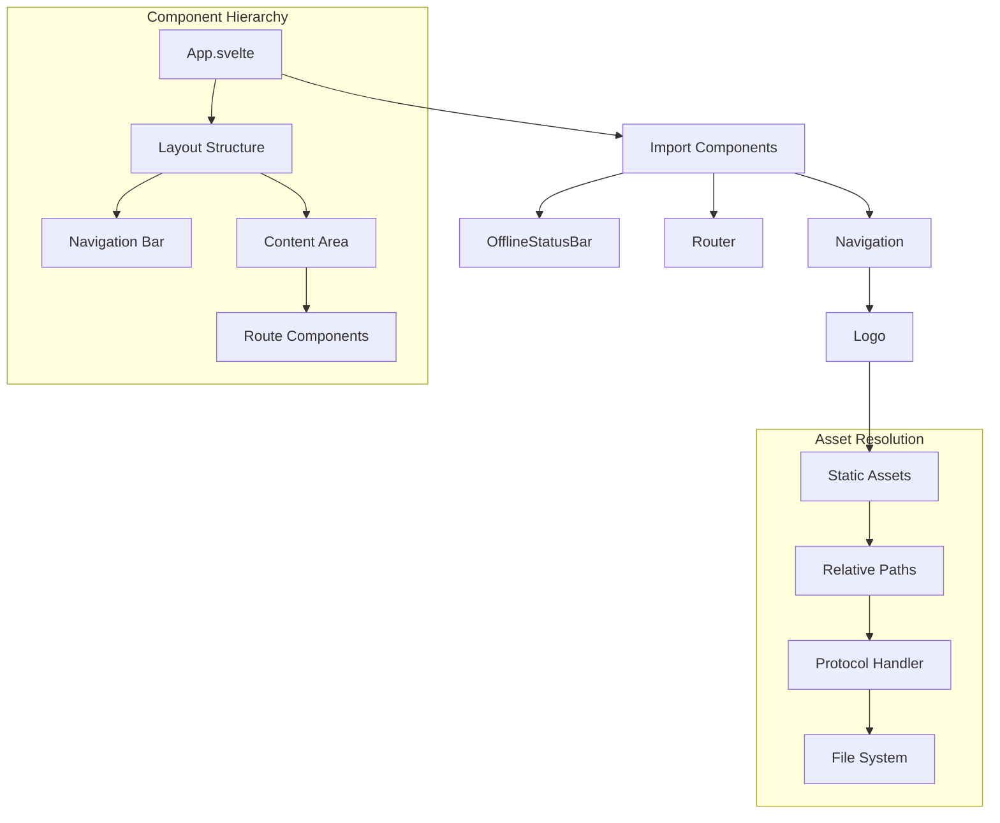
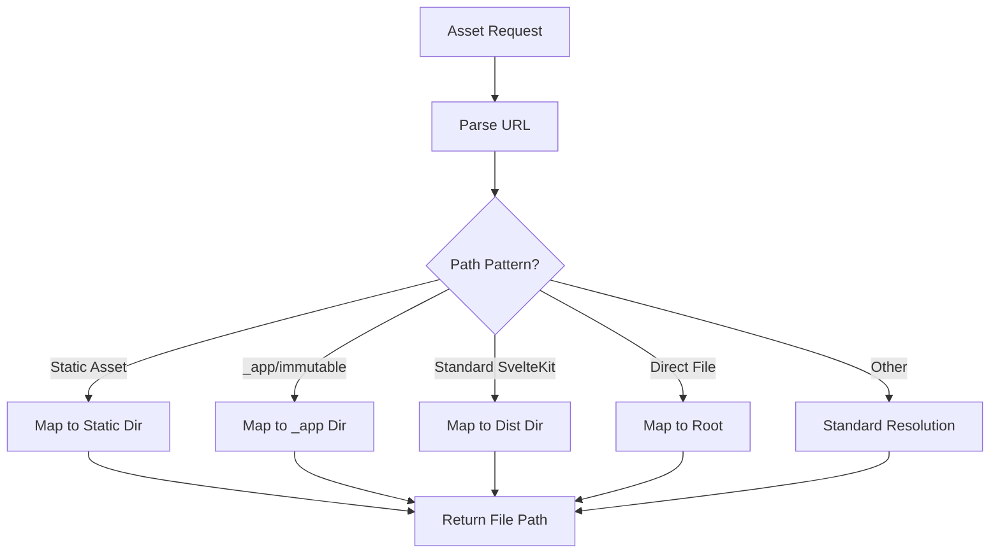
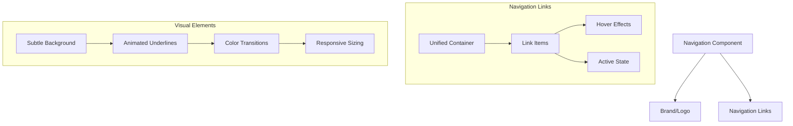

# System Patterns

## Architecture Overview
Codex MD follows an Electron architecture with a clear separation between the main process and renderer process:

1. **Main Process** (Node.js)
   - Handles system-level operations
   - Manages windows and application lifecycle
   - Provides IPC communication
   - Registers protocol handlers

2. **Renderer Process** (SvelteKit)
   - Provides the user interface
   - Handles user interactions
   - Communicates with the main process via IPC

## Key Technical Patterns

### Layered Converter Architecture
The application implements a layered converter architecture to handle file conversions in a standardized, maintainable way.



#### Implementation Details
- **Layered Architecture**: Clear separation of responsibilities between layers
  - ElectronConversionService: Service-level concerns, IPC handling
  - UnifiedConverterFactory: File handling, progress tracking, Electron-specific concerns
  - ConverterRegistry: Converter registry, interface standardization
  - Individual converters: Actual conversion logic

- **URL Handling Pattern**: Special handling for URLs to prevent treating them as files
  - URL Detection: Identify URLs early in the conversion process
  - Direct Converter Access: Access URL converters directly by type rather than by extension
  - Skip File Extension Parsing: Avoid parsing URLs as filenames with extensions
  - URL-specific Processing: Use specialized processing path for web content

- **Standardized Interface**: All converters must implement a consistent interface:
  ```javascript
  {
    convert: async (content, name, apiKey, options) => Result, // Method name MUST be 'convert'
    validate: (content) => boolean,
    config: {
      name: string,
      extensions: string[],
      mimeTypes: string[],
      maxSize: number
    }
  }
  ```
  
- **Method Name Consistency**: The method name `convert` is critical and must be used consistently:
  ```javascript
  // Correct implementation
  export const myConverter = {
    convert: async (content, options) => { /* implementation */ },
    validate: (content) => { /* implementation */ },
    config: { /* configuration */ }
  };
  
  // Incorrect implementation - will cause "converter.convert is not a function" error
  export const myConverter = {
    convertToMarkdown: async (content, options) => { /* implementation */ },
    validate: (content) => { /* implementation */ },
    config: { /* configuration */ }
  };
  ```

- **Import and Access Pattern**: When importing and registering converters, ensure the correct object path is used:
  ```javascript
  // Import statement
  import * as urlConverter from './web/urlConverter.js';
  
  // Correct registration - accessing the nested 'convert' method on the exported object
  url: {
    convert: urlConverter.urlConverter.convert,
    validate: (input) => typeof input === 'string' && input.length > 0,
    config: { /* configuration */ }
  }
  
  // Incorrect registration - will cause "converter.convert is not a function" error
  url: {
    convert: urlConverter.convert, // This doesn't exist at this path
    validate: (input) => typeof input === 'string' && input.length > 0,
    config: { /* configuration */ }
  }
  ```

- **Converter Validation**: Validates converters at runtime to ensure they implement the required interface
- **Error Handling**: Consistent error handling and recovery across all converters
- **Result Standardization**: Ensures all conversion results follow a consistent format
- **Progress Tracking**: Unified progress tracking across all conversion types
- **Extensibility**: Easy to add new converters by registering them with the ConverterRegistry
- **Fallback Mechanisms**: Implements fallbacks for conversion failures
- **Timeout Protection**: Prevents conversions from hanging indefinitely

#### Benefits
- **Maintainability**: Easier to maintain with clear separation of concerns
- **Consistency**: Consistent behavior across all conversion types
- **Robustness**: Better error handling and recovery
- **Extensibility**: Easier to add new conversion types
- **Testability**: Easier to test individual components

### Protocol Handling Pattern
The application uses enhanced protocol handlers to serve static assets in the Electron environment, which is particularly important for Windows compatibility.



#### Implementation Details
- **Enhanced file:// Protocol Handler**: Intercepts file:// requests and maps them to the correct locations in the filesystem
- **Windows Path Handling**: Special handling for Windows paths with drive letters
- **Static Asset Resolution**: Maps requests for static assets to the correct locations
- **ASAR-aware Path Resolution**: Ensures paths work correctly in packaged apps with ASAR archives
- **Fallback Mechanisms**: Implements retries and fallbacks for asset loading failures

### Static Asset Management
The application ensures static assets are properly handled in both development and production environments.



#### Implementation Details
- **SvelteKit Configuration**: Uses relative paths for assets
- **Electron Builder Config**: Includes both dist and static directories
- **afterPack Script**: Verifies critical assets exist and copies them if needed
- **Path Normalization**: Ensures consistent path handling across platforms

### Error Handling and Recovery
The application implements robust error handling and recovery mechanisms for asset loading failures.



#### Implementation Details
- **Detailed Logging**: Logs all asset requests and errors
- **Retry Mechanism**: Implements delayed retries for failed loads
- **Fallback Paths**: Tries alternative paths for critical assets
- **User Feedback**: Provides clear error messages when recovery fails

### File Locking Prevention
The application implements strategies to prevent file locking issues during the build process, which is particularly important on Windows.



#### Implementation Details
- **Dedicated Resource Files**: Separates files used for different purposes (e.g., app-icon.png vs. logo.png, favicon-icon.png vs. favicon.png)
- **Resource Duplication Strategy**: Creates dedicated copies of assets that serve multiple purposes to avoid file locking
- **Pre-build Cleanup**: Ensures no file handles are open before the build process starts
- **Retry Logic**: Implements delayed retries for file operations that encounter EBUSY errors
- **Graceful Failure**: Continues the build process even if some non-critical file operations fail
- **Enhanced Logging**: Provides detailed information about file operations and locking issues

### Electron Build Process Optimization
The application implements an optimized build process to prevent file locking issues and ensure reliable packaging, especially on Windows.



#### Implementation Details
- **Consolidated Resource Configuration**: Uses a single extraResources configuration in package.json to avoid conflicts
- **Builder-Managed Assets**: Lets electron-builder handle asset copying rather than manual scripts
- **Enhanced Cleanup Script**: Implements exponential backoff and multiple retry attempts for locked files
- **Safe Verification**: Uses non-locking file checks in afterPack script to verify assets without causing locks
- **Simplified Build Pipeline**: Removes unnecessary manual file copying steps from the build process
- **Detailed Logging**: Provides comprehensive logging throughout the build process for debugging
- **Graceful Error Handling**: Continues the build process even when encountering non-critical errors

### URL Conversion Pattern
The application implements a specialized pattern for handling URL conversions, ensuring they are processed correctly without being treated as files with extensions.



#### Implementation Details
- **URL Type Detection**: Identifies URLs based on the fileType property rather than trying to extract an extension
- **Direct Converter Access**: Accesses URL converters directly by type ('url' or 'parenturl') rather than by extension
- **URL Filename Creation**: Creates a reasonable filename from the URL for display purposes
- **Skip File Extension Parsing**: Avoids trying to parse URLs as filenames with extensions
- **Specialized Processing Path**: Uses a different code path for URLs vs. files
- **Metadata Extraction**: Extracts metadata from the URL itself rather than from file content
- **Standardized Converter Interface**: All converters must implement the standardized interface:
  ```javascript
  {
    convert: async (content, name, apiKey, options) => Result,
    validate: (content) => boolean,
    config: {
      name: string,
      extensions: string[],
      mimeTypes: string[],
      maxSize: number
    }
  }
  ```
- **Method Name Consistency**: The `convert` method name must be used consistently across all converters to ensure proper function calls
- **Interface Validation**: The ConverterRegistry validates that all converters implement the required interface at runtime

#### Benefits
- **Robustness**: Prevents errors when processing URLs with domain extensions (like .ai, .io, etc.)
- **Clarity**: Clear separation between URL handling and file handling
- **Consistency**: Consistent approach to URL processing throughout the application
- **Extensibility**: Easy to add new URL-based converters without affecting file converters
- **Error Prevention**: Runtime validation catches interface implementation errors early

### Component Integration Pattern
The application ensures proper component integration in both development and production environments, with special attention to navigation and UI elements.



#### Implementation Details
- **Component Hierarchy**: Clear parent-child relationships between components
- **Navigation Integration**: Navigation component included in the main App component
- **Relative Asset Paths**: Using relative paths (./asset.png) instead of absolute paths (/asset.png)
- **Component Documentation**: Each component includes detailed documentation about its purpose and connections
- **Consistent Import Pattern**: Standard approach to importing and using components

### SvelteKit Asset Path Resolution
The application implements enhanced path resolution for SvelteKit-generated assets, which is critical for proper loading in the Electron environment.



#### Implementation Details
- **Pattern Recognition**: Identifies different SvelteKit asset path patterns
- **Special Case Handling**: Implements specific handlers for different path formats
- **_app/immutable Pattern**: Special handling for newer SvelteKit build output format
- **Direct File Requests**: Handles cases where files are referenced without a path
- **Enhanced Logging**: Detailed logging of path resolution for debugging

## UI Patterns

### Modern Navigation Pattern
The application implements a modern, unified navigation bar that provides a cohesive user experience.



#### Implementation Details
- **Unified Navigation Bar**: Single cohesive container instead of separate boxes for each item
- **Subtle Hover Effects**: Animated underline and background color changes on hover
- **Active State Indicators**: Clear visual indicators for the current route
- **Accessibility Support**: High contrast mode support with appropriate outlines
- **Responsive Design**: Adjusts spacing, sizing, and layout for different screen sizes
- **Animation**: Smooth transitions for hover and active states
- **CSS Variables**: Uses theme variables for consistent styling

## Cross-Platform Considerations

### Windows-Specific Patterns
- **Drive Letter Handling**: Special handling for Windows paths with drive letters (e.g., C:/)
- **Backslash Normalization**: Handles both forward and backslashes in paths
- **ASAR Path Resolution**: Ensures paths work correctly in ASAR-packaged apps on Windows
- **File Locking Handling**: Implements strategies to deal with stricter file locking on Windows

### Development vs. Production
- **Development Mode**: Uses local dev server with hot reloading
- **Production Mode**: Uses file:// protocol with enhanced path resolution
- **Static Asset Handling**: Different paths for development and production
- **Build Process**: Different strategies for development builds vs. production packaging
