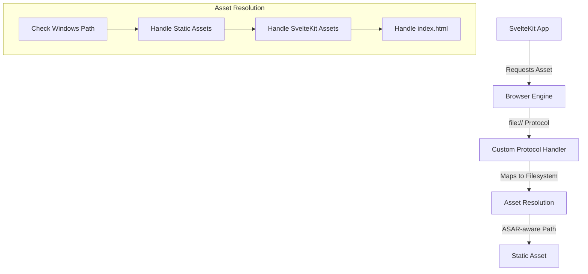
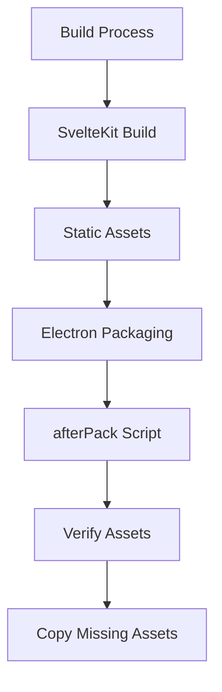
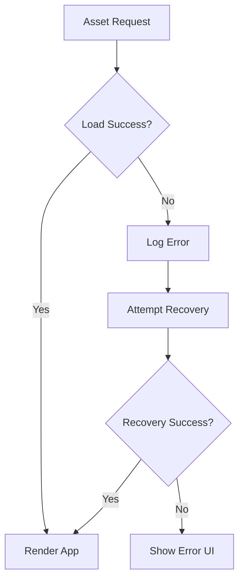
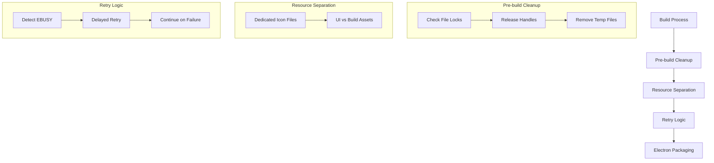
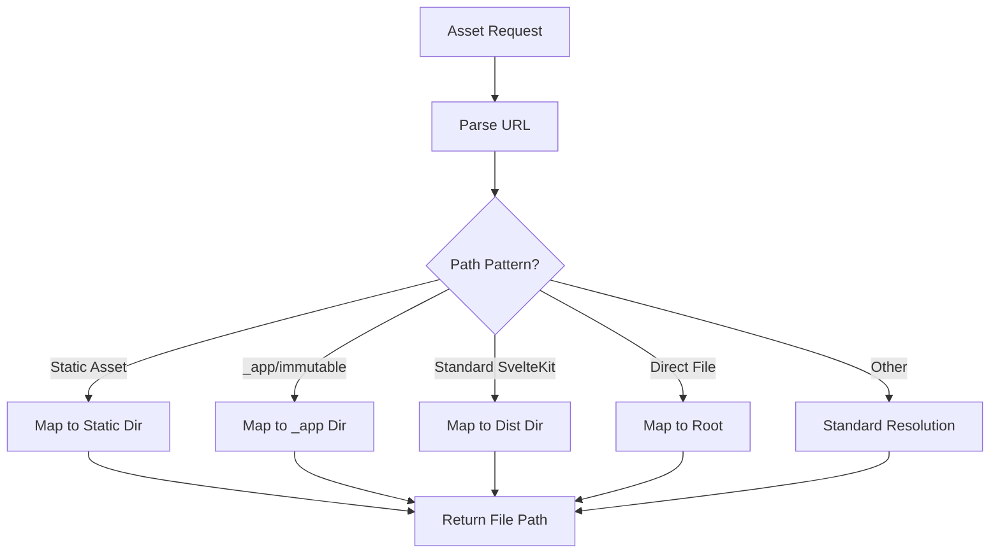

# System Patterns

## Architecture Overview
Codex MD follows an Electron architecture with a clear separation between the main process and renderer process:

1. **Main Process** (Node.js)
   - Handles system-level operations
   - Manages windows and application lifecycle
   - Provides IPC communication
   - Registers protocol handlers

2. **Renderer Process** (SvelteKit)
   - Provides the user interface
   - Handles user interactions
   - Communicates with the main process via IPC

## Key Technical Patterns

### Protocol Handling Pattern
The application uses enhanced protocol handlers to serve static assets in the Electron environment, which is particularly important for Windows compatibility.

#### Implementation Details
- **Enhanced file:// Protocol Handler**: Intercepts file:// requests and maps them to the correct locations in the filesystem
- **Windows Path Handling**: Special handling for Windows paths with drive letters
- **Static Asset Resolution**: Maps requests for static assets to the correct locations
- **ASAR-aware Path Resolution**: Ensures paths work correctly in packaged apps with ASAR archives
- **Fallback Mechanisms**: Implements retries and fallbacks for asset loading failures

### Static Asset Management
The application ensures static assets are properly handled in both development and production environments.

#### Implementation Details
- **SvelteKit Configuration**: Uses relative paths for assets
- **Electron Builder Config**: Includes both dist and static directories
- **afterPack Script**: Verifies critical assets exist and copies them if needed
- **Path Normalization**: Ensures consistent path handling across platforms

### Error Handling and Recovery
The application implements robust error handling and recovery mechanisms for asset loading failures.

#### Implementation Details
- **Detailed Logging**: Logs all asset requests and errors
- **Retry Mechanism**: Implements delayed retries for failed loads
- **Fallback Paths**: Tries alternative paths for critical assets
- **User Feedback**: Provides clear error messages when recovery fails

### File Locking Prevention
The application implements strategies to prevent file locking issues during the build process, which is particularly important on Windows.

#### Implementation Details
- **Dedicated Resource Files**: Separates files used for different purposes (e.g., app-icon.png vs. logo.png, favicon-icon.png vs. favicon.png)
- **Resource Duplication Strategy**: Creates dedicated copies of assets that serve multiple purposes to avoid file locking
- **Pre-build Cleanup**: Ensures no file handles are open before the build process starts
- **Retry Logic**: Implements delayed retries for file operations that encounter EBUSY errors
- **Graceful Failure**: Continues the build process even if some non-critical file operations fail
- **Enhanced Logging**: Provides detailed information about file operations and locking issues

### SvelteKit Asset Path Resolution
The application implements enhanced path resolution for SvelteKit-generated assets, which is critical for proper loading in the Electron environment.

#### Implementation Details
- **Pattern Recognition**: Identifies different SvelteKit asset path patterns
- **Special Case Handling**: Implements specific handlers for different path formats
- **_app/immutable Pattern**: Special handling for newer SvelteKit build output format
- **Direct File Requests**: Handles cases where files are referenced without a path
- **Enhanced Logging**: Detailed logging of path resolution for debugging

## Cross-Platform Considerations

### Windows-Specific Patterns
- **Drive Letter Handling**: Special handling for Windows paths with drive letters (e.g., C:/)
- **Backslash Normalization**: Handles both forward and backslashes in paths
- **ASAR Path Resolution**: Ensures paths work correctly in ASAR-packaged apps on Windows
- **File Locking Handling**: Implements strategies to deal with stricter file locking on Windows

### Development vs. Production
- **Development Mode**: Uses local dev server with hot reloading
- **Production Mode**: Uses file:// protocol with enhanced path resolution
- **Static Asset Handling**: Different paths for development and production
- **Build Process**: Different strategies for development builds vs. production packaging
