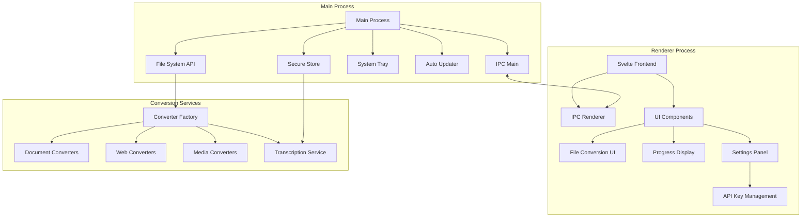

# System Patterns

## Application Architecture



## Core System Patterns

1. **File Organization Pattern**
   ```mermaid
   flowchart TD
       A[Output Location] --> B[Single Files]
       A --> C[Batch Folders]
       A --> D[Web Content]
       
       C --> E[Batch_YYYY-MM-DD]
       E --> F[Converted Files]
       
       D --> G[Page_Title]
       G --> H[index.md]
       G --> I[assets/]
   ```

2. **IPC Communication Pattern**
   - Main process handles system operations
   - Renderer process manages UI and user interaction
   - Preload script bridges main and renderer securely
   - Typed IPC messages for reliable communication

3. **Secure Storage Pattern**
   ```mermaid
   flowchart TD
       A[Secure Store] --> B[Encrypted Store]
       A --> C[System Keychain]
       A --> D[Machine ID]
       
       B --> E[Settings]
       B --> F[API Keys]
       B --> G[Credentials]
       
       C --> H[OS Security]
       
       D --> I[Encryption Key]
       D --> J[Store Protection]
   ```

4. **File System Operations**
   - Direct file system access via main process
   - Structured folder creation and management
   - Watch patterns for file changes
   - Secure file handling with permissions
   - Atomic file operations for reliability
   - Asset management for web content
   - Batch operation coordination
   - Error recovery and cleanup

5. **Converter Factory Pattern**
   - Dynamic converter selection based on file type
   - Pluggable converter architecture
   - Common interface for all converters
   - Error handling and progress reporting

6. **Event-Driven Architecture**
   - System-wide events for state changes
   - Progress updates via IPC channels
   - Error handling across processes
   - Background task management

## Component Patterns

1. **UI Components**
   ```mermaid
   flowchart TD
       A[App Container] --> B[File Drop Zone]
       A --> C[Conversion Panel]
       A --> D[Settings]
       B --> E[File List]
       C --> F[Progress Display]
       C --> G[Conversion Options]
       D --> H[API Key Management]
   ```

2. **Service Layer**
   ```mermaid
   flowchart TD
       A[Main IPC Handler] --> B[Converter Service]
       B --> C[File System Service]
       B --> D[Conversion Queue]
       B --> E[Secure Store Service]
       D --> F[Progress Manager]
       E --> G[API Key Manager]
   ```

3. **Storage Patterns**
   ```mermaid
   flowchart TD
       A[Storage Manager] --> B[Settings Store]
       A --> C[File System]
       A --> D[Recent Files]
       A --> E[Secure Store]
       
       B --> F[User Preferences]
       B --> G[Converter Options]
       
       C --> H[Output Directory]
       C --> I[Asset Storage]
       C --> J[Temp Files]
       
       D --> K[History]
       D --> L[Quick Access]

       E --> M[Encrypted Keys]
       E --> N[Usage Data]
   ```

## Error Handling

1. **Error Types**
   - Conversion Errors
   - File System Errors
   - IPC Communication Errors
   - Runtime Errors
   - API Authentication Errors
   - Encryption Errors

2. **Recovery Strategies**
   - Automatic retry for transient failures
   - Graceful degradation for offline features
   - User notification system
   - Error logging and reporting
   - Secure error details filtering

## Background Processing

1. **Task Queue**
   ```mermaid
   flowchart TD
       A[Task Queue] --> B[Priority Manager]
       A --> C[Resource Monitor]
       
       B --> D[Single Files]
       B --> E[Batch Jobs]
       B --> F[Web Content]
       B --> G[Transcription Jobs]
       
       C --> H[Disk Space]
       C --> I[Memory Usage]
       C --> J[CPU Load]
       C --> K[API Rate Limits]
   ```

2. **System Integration**
   - System tray operations
   - Native notifications
   - File associations
   - Protocol handling

## Security Patterns

1. **Process Isolation**
   - Sandboxed renderer process
   - Secure IPC communication
   - Content Security Policy
   - Input validation

2. **Data Security**
   ```mermaid
   flowchart TD
       A[Security Manager] --> B[File Security]
       A --> C[API Security]
       A --> D[Storage Security]
       
       B --> E[Permissions]
       B --> F[Path Validation]
       
       C --> G[Key Management]
       C --> H[Usage Tracking]
       
       D --> I[Encryption]
       D --> J[Access Control]
   ```

3. **Encryption Patterns**
   - Machine-specific key generation
   - Secure key storage
   - Data encryption at rest
   - Secure memory handling
   - Key rotation support
