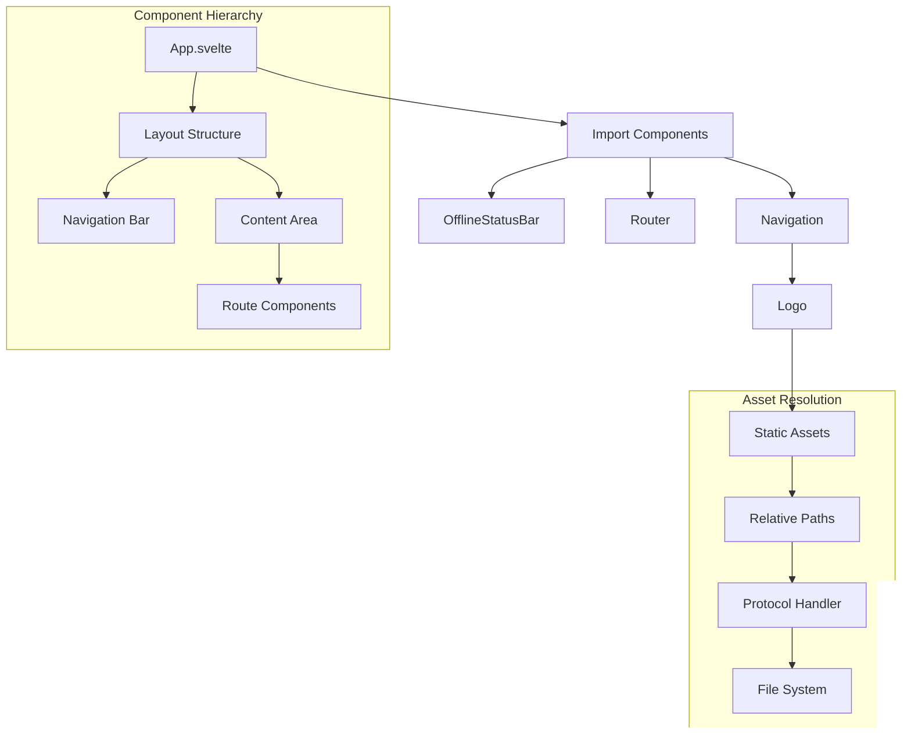

# System Patterns

## Architecture Overview
Codex MD follows an Electron architecture with a clear separation between the main process and renderer process:

1. **Main Process** (Node.js)
   - Handles system-level operations
   - Manages windows and application lifecycle
   - Provides IPC communication
   - Registers protocol handlers

2. **Renderer Process** (SvelteKit)
   - Provides the user interface
   - Handles user interactions
   - Communicates with the main process via IPC

## Key Technical Patterns

### Layered Converter Architecture
The application implements a layered converter architecture to handle file conversions in a standardized, maintainable way.


#### Implementation Details
- **Layered Architecture**: Clear separation of responsibilities between layers
  - ElectronConversionService: Service-level concerns, IPC handling
  - UnifiedConverterFactory: File handling, progress tracking, Electron-specific concerns
  - ConverterRegistry: Converter registry, interface standardization
  - Individual converters: Actual conversion logic

- **Converter Registration Pattern**: All converters must be registered in the ConverterRegistry
  ```javascript
  // Import converter implementation
  import AudioConverter from './multimedia/audioconverter.js';
  
  // Create instance if needed
  const audioConverter = new AudioConverter();
  
  // Register in converters object
  const converters = {
    audio: {
      convert: async (content, name, apiKey, options) => {
        return await audioConverter.convertToMarkdown(content, {
          name,
          apiKey,
          ...options
        });
      },
      validate: (input) => Buffer.isBuffer(input) && input.length > 0,
      config: {
        name: 'Audio File',
        extensions: ['.mp3', '.wav', '.ogg', '.m4a', '.mpga'],
        mimeTypes: [
          'audio/mpeg',
          'audio/mp3',
          'audio/wav',
          'audio/ogg',
          'audio/m4a'
        ],
        maxSize: 100 * 1024 * 1024, // 100MB
      }
    },
    // Other converters...
  }
  ```

- **URL Handling Pattern**: Special handling for URLs to prevent treating them as files
  - URL Detection: Identify URLs early in the conversion process
  - Direct Converter Access: Access URL converters directly by type rather than by extension
  - Skip File Extension Parsing: Avoid parsing URLs as filenames with extensions
  - URL-specific Processing: Use specialized processing path for web content

- **Media Handling Pattern**: Special handling for audio and video files
  - Buffer Processing: Handle binary data efficiently
  - API Key Validation: Ensure required API keys are present for transcription
  - Chunking for Large Files: Split large audio/video files into manageable chunks
  - Transcription: Convert audio to text using external APIs
  - Progress Tracking: Provide detailed progress updates during lengthy conversions
  - Path Handling: Use Node.js built-in path functions instead of custom methods
    ```javascript
    // Correct approach - use built-in Node.js path functions
    const tempDir = PathUtils.normalizePath(path.join(os.tmpdir(), uuidv4()));
    const inputPath = path.join(tempDir, 'input.mp4');
    const outputPath = path.join(tempDir, 'output.mp3');
    
    // Incorrect approach - using non-existent methods
    const inputPath = PathUtils.resolvePath(tempDir, 'input.mp4');
    const outputPath = PathUtils.toPlatformPath(outputPath);
    ```

- **Standardized Interface**: All converters must implement a consistent interface:
  ```javascript
  {
    convert: async (content, name, apiKey, options) => Result, // Method name MUST be 'convert'
    validate: (content) => boolean,
    config: {
      name: string,
      extensions: string[],
      mimeTypes: string[],
      maxSize: number
    }
  }
  ```
  
- **Method Name Consistency**: The method name `convert` is critical and must be used consistently:
  ```javascript
  // Correct implementation
  export const myConverter = {
    convert: async (content, options) => { /* implementation */ },
    validate: (content) => { /* implementation */ },
    config: { /* configuration */ }
  };
  
  // Incorrect implementation - will cause "converter.convert is not a function" error
  export const myConverter = {
    convertToMarkdown: async (content, options) => { /* implementation */ },
    validate: (content) => { /* implementation */ },
    config: { /* configuration */ }
  };
  ```

- **Import and Access Pattern**: When importing and registering converters, ensure the correct object path is used:
  ```javascript
  // Import statement
  import * as urlConverter from './web/urlConverter.js';
  
  // Correct registration - accessing the nested 'convert' method on the exported object
  url: {
    convert: urlConverter.urlConverter.convert,
    validate: (input) => typeof input === 'string' && input.length > 0,
    config: { /* configuration */ }
  }
  
  // Incorrect registration - will cause "converter.convert is not a function" error
  url: {
    convert: urlConverter.convert, // This doesn't exist at this path
    validate: (input) => typeof input === 'string' && input.length > 0,
    config: { /* configuration */ }
  }
  ```

- **Converter Validation**: Validates converters at runtime to ensure they implement the required interface
- **Error Handling**: Consistent error handling and recovery across all converters
- **Result Standardization**: Ensures all conversion results follow a consistent format
- **Progress Tracking**: Unified progress tracking across all conversion types
- **Extensibility**: Easy to add new converters by registering them with the ConverterRegistry
- **Fallback Mechanisms**: Implements fallbacks for conversion failures
- **User-Controlled Cancellation**: Allows users to cancel long-running conversions via a dedicated cancel button in the UI

#### Benefits
- **Maintainability**: Easier to maintain with clear separation of concerns
- **Consistency**: Consistent behavior across all conversion types
- **Robustness**: Better error handling and recovery
- **Extensibility**: Easier to add new conversion types
- **Testability**: Easier to test individual components

### Protocol Handling Pattern
The application uses enhanced protocol handlers to serve static assets in the Electron environment, which is particularly important for Windows compatibility.


#### Implementation Details
- **Enhanced file:// Protocol Handler**: Intercepts file:// requests and maps them to the correct locations in the filesystem
- **Windows Path Handling**: Special handling for Windows paths with drive letters
- **Static Asset Resolution**: Maps requests for static assets to the correct locations
- **ASAR-aware Path Resolution**: Ensures paths work correctly in packaged apps with ASAR archives
- **Fallback Mechanisms**: Implements retries and fallbacks for asset loading failures

### Static Asset Management
The application ensures static assets are properly handled in both development and production environments.


#### Implementation Details
- **SvelteKit Configuration**: Uses relative paths for assets
- **Electron Builder Config**: Includes both dist and static directories
- **afterPack Script**: Verifies critical assets exist and copies them if needed
- **Path Normalization**: Ensures consistent path handling across platforms

### Error Handling and Recovery
The application implements robust error handling and recovery mechanisms for asset loading failures.


#### Implementation Details
- **Detailed Logging**: Logs all asset requests and errors
- **Retry Mechanism**: Implements delayed retries for failed loads
- **Fallback Paths**: Tries alternative paths for critical assets
- **User Feedback**: Provides clear error messages when recovery fails

### File Locking Prevention
The application implements strategies to prevent file locking issues during the build process, which is particularly important on Windows.


#### Implementation Details
- **Dedicated Resource Files**: Separates files used for different purposes (e.g., app-icon.png vs. logo.png, favicon-icon.png vs. favicon.png)
- **Resource Duplication Strategy**: Creates dedicated copies of assets that serve multiple purposes to avoid file locking
- **Pre-build Cleanup**: Ensures no file handles are open before the build process starts
- **Retry Logic**: Implements delayed retries for file operations that encounter EBUSY errors
- **Graceful Failure**: Continues the build process even if some non-critical file operations fail
- **Enhanced Logging**: Provides detailed information about file operations and locking issues

### Electron Build Process Optimization
The application implements an optimized build process to prevent file locking issues and ensure reliable packaging, especially on Windows.


#### Implementation Details
- **Consolidated Resource Configuration**: Uses a single extraResources configuration in package.json to avoid conflicts
- **Builder-Managed Assets**: Lets electron-builder handle asset copying rather than manual scripts
- **Enhanced Cleanup Script**: Implements exponential backoff and multiple retry attempts for locked files
- **Safe Verification**: Uses non-locking file checks in afterPack script to verify assets without causing locks
- **Simplified Build Pipeline**: Removes unnecessary manual file copying steps from the build process
- **Detailed Logging**: Provides comprehensive logging throughout the build process for debugging
- **Graceful Error Handling**: Continues the build process even when encountering non-critical errors

### OCR Conversion Pattern
The application implements a specialized pattern for handling PDF conversions with OCR capabilities, ensuring that OCR settings are properly passed through the entire conversion pipeline.


#### Implementation Details
- **OCR Options Propagation**: Ensures OCR settings are consistently passed through all layers of the conversion pipeline
- **Wrapper Function Pattern**: Uses a wrapper function in the converter registry to ensure OCR options are correctly passed to the PDF converter
- **Consistent Parameter Handling**: Ensures parameters are passed in the correct order and with the right structure
- **Validation with Options**: Passes OCR options to validation functions to ensure consistent converter selection
- **Detailed Logging**: Logs OCR options at each step of the conversion process for debugging
- **Fallback Mechanism**: Falls back to standard conversion if OCR fails or if Mistral API key is missing

#### Mistral OCR API Integration
- **File Upload Workflow**: Implements a three-step process for OCR processing:
  1. Upload the PDF file to Mistral's servers using the `/files` endpoint
  2. Get a signed URL for the uploaded file using the `/files/{id}/url` endpoint
  3. Call the `/ocr` endpoint using the signed URL with `type: "document_url"`
- **FormData Handling**: Uses the FormData API to properly upload files to Mistral's servers
- **Error Handling**: Implements robust error handling for each step of the process
- **Response Processing**: Processes the OCR response to extract text and structural information
- **Variable Consistency**: Ensures consistent variable naming throughout the workflow to prevent reference errors

#### Benefits
- **Consistency**: Ensures the same converter is used for both validation and conversion
- **Reliability**: Prevents OCR settings from being lost during the conversion process
- **Transparency**: Provides clear logging of OCR options throughout the pipeline
- **Robustness**: Handles edge cases and provides fallbacks when needed
- **Maintainability**: Clear separation of concerns between converter selection and conversion logic

### URL Conversion Pattern
The application implements a specialized pattern for handling URL conversions, ensuring they are processed correctly without being treated as files with extensions.


#### Implementation Details
- **URL Type Detection**: Identifies URLs based on the fileType property rather than trying to extract an extension
- **Direct Converter Access**: Accesses URL converters directly by type ('url' or 'parenturl') rather than by extension
- **URL Filename Creation**: Creates a reasonable filename from the URL for display purposes
- **Skip File Extension Parsing**: Avoids trying to parse URLs as filenames with extensions
- **Specialized Processing Path**: Uses a different code path for URLs vs. files
- **Metadata Extraction**: Extracts metadata from the URL itself rather than from file content
- **Standardized Converter Interface**: All converters must implement the standardized interface:
  ```javascript
  {
    convert: async (content, name, apiKey, options) => Result,
    validate: (content) => boolean,
    config: {
      name: string,
      extensions: string[],
      mimeTypes: string[],
      maxSize: number
    }
  }
  ```
- **Method Name Consistency**: The `convert` method name must be used consistently across all converters to ensure proper function calls
- **Interface Validation**: The ConverterRegistry validates that all converters implement the required interface at runtime

#### Benefits
- **Robustness**: Prevents errors when processing URLs with domain extensions (like .ai, .io, etc.)
- **Clarity**: Clear separation between URL handling and file handling
- **Consistency**: Consistent approach to URL processing throughout the application
- **Extensibility**: Easy to add new URL-based converters without affecting file converters
- **Error Prevention**: Runtime validation catches interface implementation errors early

### Component Integration Pattern
The application ensures proper component integration in both development and production environments, with special attention to navigation and UI elements.



#### Implementation Details
- **Component Hierarchy**: Clear parent-child relationships between components
- **Navigation Integration**: Navigation component included in the main App component
- **Relative Asset Paths**: Using relative paths (./asset.png) instead of absolute paths (/asset.png)
- **Component Documentation**: Each component includes detailed documentation about its purpose and connections
- **Consistent Import Pattern**: Standard approach to importing and using components

### SvelteKit Asset Path Resolution
The application implements enhanced path resolution for SvelteKit-generated assets, which is critical for proper loading in the Electron environment.


#### Implementation Details
- **Pattern Recognition**: Identifies different SvelteKit asset path patterns
- **Special Case Handling**: Implements specific handlers for different path formats
- **_app/immutable Pattern**: Special handling for newer SvelteKit build output format
- **Direct File Requests**: Handles cases where files are referenced without a path
- **Enhanced Logging**: Detailed logging of path resolution for debugging

## External Binary Management Pattern
The application implements a robust pattern for handling external binaries (like FFmpeg) in Electron applications, ensuring they are properly included in the packaged application and correctly resolved in both development and production environments.


### Implementation Details
- **Environment Detection**: Reliably detect whether the application is running in development or production:
  ```javascript
  const isProduction = process.env.NODE_ENV === 'production' || (app && app.isPackaged);
  ```

- **Path Resolution Pattern**: Resolve binary paths differently based on environment:
  ```javascript
  // For production environment
  if (isProduction) {
    binaryPath = path.join(process.resourcesPath, 'binary.exe');
  } else {
    // For development environment
    const binaryPackage = require('binary-package');
    binaryPath = binaryPackage.path;
  }
  ```

- **Binary Verification**: Always verify that binaries exist before attempting to use them:
  ```javascript
  if (!fs.existsSync(binaryPath)) {
    const errorMsg = `Binary missing at ${binaryPath}`;
    console.error(`[Service] ${errorMsg}`);
    throw new Error(errorMsg);
  }
  ```

- **Binary Packaging**: Use the afterPack script to ensure binaries are included in the packaged application:
  ```javascript
  // In afterPack.js
  async function safeCopyFile(source, destination) {
    try {
      await fs.ensureDir(path.dirname(destination));
      await fs.copyFile(source, destination);
      console.log(`✅ Successfully copied: ${path.basename(source)} to ${destination}`);
      return true;
    } catch (error) {
      console.error(`❌ Error copying ${source} to ${destination}:`, error.message);
      return false;
    }
  }
  
  // Copy binary with fallback
  try {
    const primarySrc = require.resolve('primary-package/binary.exe');
    const binaryDest = path.join(resourcesDir, 'binary.exe');
    await safeCopyFile(primarySrc, binaryDest);
  } catch (primaryError) {
    console.error('❌ Error with primary source:', primaryError.message);
    console.log('⚠️ Attempting to use alternative source...');
    
    try {
      // Try alternative source
      const fallbackSrc = require.resolve('fallback-package/binary.exe');
      const binaryDest = path.join(resourcesDir, 'binary.exe');
      await safeCopyFile(fallbackSrc, binaryDest);
    } catch (fallbackError) {
      console.error('❌ Error with fallback source:', fallbackError.message);
    }
  }
  ```

- **Verification After Packaging**: Verify that binaries were successfully copied:
  ```javascript
  const binaryPath = path.join(resourcesDir, 'binary.exe');
  if (await safePathExists(binaryPath)) {
    console.log('✅ Verified binary.exe');
  } else {
    console.warn('⚠️ binary.exe not found in resources after copy attempt');
  }
  ```

- **Clear Error Messages**: Provide clear error messages when binaries are missing:
  ```javascript
  throw new Error(`Conversion failed: Binary missing at ${binaryPath}. Please ensure the application is properly installed.`);
  ```

- **Library Configuration**: Configure external libraries to use the correct binary paths:
  ```javascript
  // For libraries like fluent-ffmpeg
  library.setPath(binaryPath);
  ```

### Benefits
- **Reliability**: Ensures binaries are available in both development and production environments
- **Clarity**: Provides clear error messages when binaries are missing
- **Robustness**: Implements fallback mechanisms for binary resolution
- **Maintainability**: Centralizes binary management in a single location
- **Consistency**: Ensures consistent binary resolution across the application
- **Debugging**: Provides detailed logging for troubleshooting binary issues

### Common Pitfalls to Avoid
- **Hardcoded Paths**: Avoid hardcoding binary paths, as they will differ between environments
- **Missing Verification**: Always verify that binaries exist before attempting to use them
- **Incomplete Packaging**: Ensure binaries are properly included in the packaged application
- **Unclear Error Messages**: Provide clear error messages that help users understand and resolve issues
- **Single Source Dependency**: Implement fallback mechanisms for binary resolution to handle package changes

### ASAR-Compatible Binary Management
The application implements specialized handling for external binaries when packaged in ASAR archives, addressing a common issue where binaries cannot be executed directly from within an ASAR archive.


#### Implementation Details
- **ASAR Incompatibility Issue**: Binaries cannot be executed directly from within an ASAR archive, causing "Conversion produced empty content" errors.

- **Solution 1: Path Remapping Technique**:
  ```javascript
  const ffmpegPath = process.env.NODE_ENV === 'production'
    ? require('ffmpeg-static').replace('app.asar', 'app.asar.unpacked')
    : require('ffmpeg-static');
  ```

- **Solution 2: Electron-Builder Configuration**:
  ```json
  "build": {
    "asarUnpack": ["**/node_modules/ffmpeg-static/**"],
    "extraResources": [{
      "from": "node_modules/ffmpeg-static/ffmpeg.exe",
      "to": "app/node_modules/ffmpeg-static"
    }]
  }
  ```

- **Solution 3: Specialized Packaging Solution**:
  Using electron-forge optimized packages like ffmpeg-static-electron-forge

- **Recommended Implementation**: Combine path remapping with Electron-Builder configuration:
  ```javascript
  configureFfmpeg() {
    let ffmpegPath, ffprobePath;
    
    // Detect if we're in production
    const isProduction = process.env.NODE_ENV === 'production' || (app && app.isPackaged);
    
    if (isProduction) {
      // For production, use the unpacked path
      try {
        // First try the path from ffmpeg-static but replace app.asar with app.asar.unpacked
        ffmpegPath = require('ffmpeg-static').replace('app.asar', 'app.asar.unpacked');
        
        // If that doesn't exist, fall back to resources directory
        if (!fs.existsSync(ffmpegPath)) {
          ffmpegPath = path.join(process.resourcesPath, 'ffmpeg.exe');
        }
      } catch (err) {
        // If ffmpeg-static fails, use resources directory
        ffmpegPath = path.join(process.resourcesPath, 'ffmpeg.exe');
      }
    } else {
      // For development, use the paths from the packages
      ffmpegPath = require('ffmpeg-static');
    }
    
    // Verify binary exists
    this.verifyBinary(ffmpegPath, 'FFmpeg');
    
    return { ffmpegPath };
  }
  ```

- **Enhanced afterPack.js Verification**:
  ```javascript
  // Add specific checks for unpacked FFmpeg binaries
  const unpackedDir = path.join(appOutDir, 'resources', 'app.asar.unpacked');
  console.log('Checking unpacked directory:', unpackedDir);
  
  if (await safePathExists(unpackedDir)) {
    console.log('✅ app.asar.unpacked directory exists');
    
    // Check for ffmpeg-static in unpacked directory
    const ffmpegUnpackedPath = path.join(unpackedDir, 'node_modules', 'ffmpeg-static', 'ffmpeg.exe');
    if (await safePathExists(ffmpegUnpackedPath)) {
      console.log('✅ ffmpeg.exe found in unpacked directory');
      await verifyBinary(ffmpegUnpackedPath);
    } else {
      console.warn('⚠️ ffmpeg.exe not found in unpacked directory');
    }
  } else {
    console.warn('⚠️ app.asar.unpacked directory not found');
  }
  ```

#### Benefits
- **Reliability**: Ensures binaries are accessible in packaged applications
- **Flexibility**: Multiple solutions to address the issue based on project needs
- **Robustness**: Fallback mechanisms ensure binaries can be found even if primary method fails
- **Verification**: Enhanced verification in afterPack.js confirms binaries are properly unpacked
- **Clarity**: Clear error messages when binaries cannot be found

## Service Singleton Pattern
The application implements a consistent pattern for service singletons to ensure proper instantiation and usage throughout the application.


### Implementation Details
- **Singleton Creation**: Create a single instance of the service class:
  ```javascript
  // Create a single instance of the service
  const instance = new ServiceClass();
  
  // Export an object containing the instance
  module.exports = { instance };
  ```

- **Singleton Usage**: Import and use the singleton instance:
  ```javascript
  // Import the object containing the instance
  const { instance: serviceInstance } = require('./ServiceClass');
  
  // Use the instance directly

serviceInstance.method();
  ```

- **Avoid Constructor Usage**: Do not treat the imported module as a constructor:
  ```javascript
  // INCORRECT - will cause "is not a constructor" error
  const ServiceClass = require('./ServiceClass');
  const serviceInstance = new ServiceClass();
  
  // CORRECT
  const { instance: serviceInstance } = require('./ServiceClass');
  ```

### Benefits
- **Consistency**: Ensures a single instance is used throughout the application
- **Resource Efficiency**: Prevents multiple instances of resource-intensive services
- **State Management**: Maintains consistent state across the application
- **Error Prevention**: Avoids "is not a constructor" errors in packaged applications

## Multi-Stage Conversion Process Pattern
The application implements a multi-stage conversion process for video files, providing both performance optimization and fallback reliability.


### Implementation Details
- **Two-Phase Approach**: The system first attempts a fast validation/remuxing before falling back to a more comprehensive conversion:
  ```javascript
  // First attempt: Quick validation and potential remuxing
  try {
    // Fast path attempt
    const result = await quickValidation(filePath);
    return result;
  } catch (error) {
    console.log(`[VideoConverter] Fast path failed with error: ${error.message}`);
    console.log(`[VideoConverter] Falling back to comprehensive conversion`);
    
    // Fallback to comprehensive conversion
    return await comprehensiveConversion(filePath);
  }
  ```

- **Expected Log Pattern**: The logs show both failure and success messages in sequence:
  ```
  [VERBOSE] Conversion failed: {
    error: 'MP4 conversion failed: Video conversion failed: Conversion not found',
    // other details...
  }
  [INFO] Conversion completed in 46ms
  ```

- **Comprehensive Conversion Flow**: The fallback path includes multiple stages:
  ```javascript
  async processConversion(conversionId, filePath, options) {
    try {
      // Extract metadata
      const metadata = await this.getVideoMetadata(filePath);
      
      // Extract audio for transcription
      const audioPath = path.join(tempDir, 'audio.mp3');
      await this.extractAudio(filePath, audioPath);
      
      // Transcribe audio
      const transcription = await this.transcribeAudio(audioPath, options.language || 'en');
      
      // Generate markdown
      const markdown = this.generateMarkdown(metadata, thumbnails, transcription, options);
      
      return markdown;
    } catch (error) {
      // Handle errors
    }
  }
  ```

- **Registry Integration**: The conversion registry tracks the conversion through all stages:
  ```javascript
  // Update registry with status changes
  this.registry.pingConversion(conversionId, { status: 'extracting_metadata', progress: 5 });
  // Later...
  this.registry.pingConversion(conversionId, { status: 'extracting_audio', progress: 30 });
  // Later...
  this.registry.pingConversion(conversionId, { status: 'transcribing', progress: 40 });
  // Finally...
  this.registry.pingConversion(conversionId, {
    status: 'completed',
    progress: 100,
    result: markdown
  });
  ```

### Benefits
- **Performance Optimization**: Fast path for compatible files completes in milliseconds
- **Reliability**: Fallback mechanism ensures conversion succeeds even when fast path fails
- **Comprehensive Results**: Full conversion includes metadata, transcription, and formatting
- **Progress Tracking**: Detailed progress updates throughout the conversion process
- **Graceful Degradation**: System recovers automatically from initial conversion failures
- **Resource Efficiency**: Only performs expensive operations (transcription) when necessary

### Common Pitfalls to Avoid
- **Misinterpreting Logs**: The failure-then-success log pattern is expected behavior, not an error
- **Removing Fallback**: Removing the fallback path would break conversion for many file types
- **Incorrect Status Updates**: Ensure the registry is updated with the correct status at each stage
- **Missing Error Handling**: Each stage needs proper error handling to prevent silent failures
- **Incomplete Cleanup**: Temporary files must be cleaned up even when conversion fails

## Standardized Logging Pattern
The application implements a standardized logging pattern for conversion processes, ensuring consistent, clear, and contextual log messages across all converters.


### Implementation Details
- **Standardized Log Format**: Consistent format across all log messages:
  ```javascript
  // Format: [Component:PHASE][filetype] Message
  log(level, component, phase, fileType, message, details = null) {
    const prefix = `[${component}:${phase}]`;
    const contextInfo = fileType ? `[${fileType}]` : '';
    const formattedMessage = `${prefix}${contextInfo} ${message}`;
    
    switch (level) {
      case 'debug':
        console.debug(formattedMessage);
        break;
      case 'info':
        console.log(formattedMessage);
        break;
      case 'warn':
        console.warn(formattedMessage);
        break;
      case 'error':
        console.error(formattedMessage, details || '');
        break;
    }
    
    return formattedMessage;
  }
  ```

- **Conversion Status Tracking**: Explicit pipeline stages with human-readable descriptions:
  ```javascript
  // ConversionStatus.js
  const CONVERSION_PHASES = {
    STARTING: 'STARTING',
    VALIDATING: 'VALIDATING',
    FAST_ATTEMPT: 'FAST_ATTEMPT',
    EXTRACTING_METADATA: 'EXTRACTING_METADATA',
    EXTRACTING_AUDIO: 'EXTRACTING_AUDIO',
    TRANSCRIBING: 'TRANSCRIBING',
    GENERATING_MARKDOWN: 'GENERATING_MARKDOWN',
    COMPLETED: 'COMPLETED',
    FAILED: 'FAILED',
    CANCELLED: 'CANCELLED'
  };
  
  const PHASE_DESCRIPTIONS = {
    [CONVERSION_PHASES.STARTING]: 'Starting conversion process',
    [CONVERSION_PHASES.VALIDATING]: 'Validating input file',
    [CONVERSION_PHASES.FAST_ATTEMPT]: 'Attempting fast conversion path',
    [CONVERSION_PHASES.EXTRACTING_METADATA]: 'Extracting file metadata',
    [CONVERSION_PHASES.EXTRACTING_AUDIO]: 'Extracting audio from video',
    [CONVERSION_PHASES.TRANSCRIBING]: 'Transcribing audio content',
    [CONVERSION_PHASES.GENERATING_MARKDOWN]: 'Generating markdown output',
    [CONVERSION_PHASES.COMPLETED]: 'Conversion completed successfully',
    [CONVERSION_PHASES.FAILED]: 'Conversion failed',
    [CONVERSION_PHASES.CANCELLED]: 'Conversion cancelled by user'
  };
  ```

- **Logger Usage in Converters**: Consistent logging across all conversion phases:
  ```javascript
  // In VideoConverter.js
  const logger = new ConversionLogger('VideoConverter');
  
  async processConversion(conversionId, filePath, options) {
    try {
      logger.info(PHASES.STARTING, 'mp4', `Starting conversion for ${path.basename(filePath)}`);
      
      // Fast path attempt
      try {
        logger.info(PHASES.FAST_ATTEMPT, 'mp4', 'Attempting fast conversion path');
        const result = await this.quickValidation(filePath);
        logger.info(PHASES.COMPLETED, 'mp4', `Fast conversion completed in ${Date.now() - startTime}ms`);
        return result;
      } catch (fastPathError) {
        logger.warn(PHASES.FAST_ATTEMPT, 'mp4', `Fast path failed: ${fastPathError.message}`);
        logger.info(PHASES.EXTRACTING_METADATA, 'mp4', 'Falling back to comprehensive conversion');
      }
      
      // Extract metadata
      logger.info(PHASES.EXTRACTING_METADATA, 'mp4', 'Extracting video metadata');
      const metadata = await this.getVideoMetadata(filePath);
      
      // Extract audio
      logger.info(PHASES.EXTRACTING_AUDIO, 'mp4', 'Extracting audio from video');
      await this.extractAudio(filePath, audioPath);
      
      // Transcribe audio
      logger.info(PHASES.TRANSCRIBING, 'mp4', 'Transcribing audio content');
      const transcription = await this.transcribeAudio(audioPath);
      
      // Generate markdown
      logger.info(PHASES.GENERATING_MARKDOWN, 'mp4', 'Generating markdown output');
      const markdown = this.generateMarkdown(metadata, transcription);
      
      logger.info(PHASES.COMPLETED, 'mp4', `Conversion completed in ${Date.now() - startTime}ms`);
      return markdown;
    } catch (error) {
      logger.error(PHASES.FAILED, 'mp4', `Conversion failed: ${error.message}`, error);
      throw error;
    }
  }
  ```

- **Example Log Output**: Clear, contextual log messages:
  ```
  [VideoConverter:STARTING][mp4] Starting conversion for video.mp4
  [VideoConverter:FAST_ATTEMPT][mp4] Attempting fast conversion path
  [VideoConverter:FAST_ATTEMPT][mp4] Fast path failed: Empty content produced
  [VideoConverter:EXTRACTING_METADATA][mp4] Falling back to comprehensive conversion
  [VideoConverter:EXTRACTING_METADATA][mp4] Extracting video metadata
  [VideoConverter:EXTRACTING_AUDIO][mp4] Extracting audio from video
  [VideoConverter:TRANSCRIBING][mp4] Transcribing audio content
  [VideoConverter:GENERATING_MARKDOWN][mp4] Generating markdown output
  [VideoConverter:COMPLETED][mp4] Conversion completed in 12463ms
  ```

### Benefits
- **Clarity**: Clear indication of which component and phase generated each log message
- **Context Preservation**: File type and conversion phase included in every log message
- **Consistency**: Standardized format across all converters and phases
- **Traceability**: Easy to follow the conversion flow through the logs
- **Debugging**: Simplified troubleshooting with clear phase transitions
- **Documentation**: Logs serve as implicit documentation of the conversion process

### Implementation Plan
1. **Create ConversionLogger Utility**:
   - Implement standardized logging format
   - Support different log levels
   - Include component, phase, and file type context

2. **Define ConversionStatus Model**:
   - Define explicit pipeline stages
   - Map statuses to human-readable descriptions
   - Document phase transitions

3. **Update Existing Converters**:
   - Replace console.log calls with ConversionLogger
   - Add explicit phase transitions
   - Ensure consistent context information

4. **Update Registry Integration**:
   - Ensure registry status updates align with logging phases
   - Preserve context between components
   - Maintain timing information
