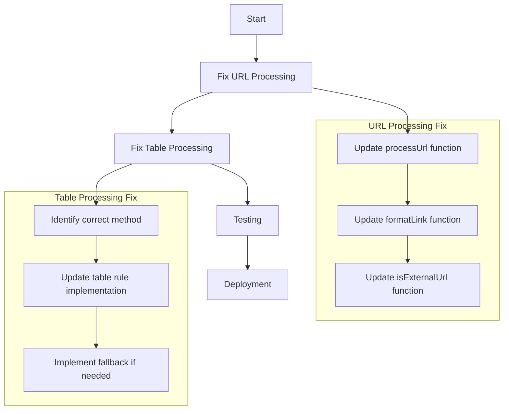

# Obsidian Converter Fix Plan

## Issues Identified

Based on the error logs and code analysis, I've identified two main issues:

1. **URL Processing Error**: The application is failing to handle fragment identifiers (URLs starting with '#') correctly. This is causing `TypeError [ERR_INVALID_URL]: Invalid URL` errors.

2. **Table Processing Error**: There's an error with `service.runRule is not a function` when processing tables in the HTML content.

## Detailed Plan

### 1. Fix URL Processing Issue

The problem is in the `UrlProcessor.js` file. When processing URLs that are fragment identifiers (like '#section-name'), the code is trying to create a URL object without a proper base URL, which is invalid according to the URL specification.

Steps to fix:
1. Modify the `processUrl` function to properly handle fragment identifiers
2. Update the `formatLink` function to handle these special cases
3. Ensure the `isExternalUrl` function doesn't try to process fragments as full URLs

### 2. Fix Table Processing Issue

The error `service.runRule is not a function` indicates that the TurndownService instance doesn't have a method called `runRule`. This is likely because:
- The method doesn't exist in the Turndown library
- The method has been renamed or removed in a newer version
- There's a custom implementation issue

Steps to fix:
1. Check the TurndownService API documentation to find the correct method to use
2. Update the table processing code to use the correct method
3. If no equivalent method exists, implement a workaround using available TurndownService methods

### 3. Testing and Validation

After implementing the fixes:
1. Test with simple pages first
2. Test with complex pages containing fragment identifiers
3. Test with pages containing tables
4. Verify that all content is properly converted to Markdown optimized for Obsidian

## Implementation Diagram



## Code Changes Overview

### For URL Processing:
```javascript
// In processUrl function
if (url.startsWith('#')) {
  // Return fragment as-is, don't try to process it as a URL
  return url;
}

// In formatLink function
if (url.startsWith('#')) {
  // Handle fragment identifiers specially for Obsidian
  return `[[${text || url.substring(1)}]]`;
}

// In isExternalUrl function
if (url.startsWith('#') || url.startsWith('/')) {
  return false; // These are always internal
}
```

### For Table Processing:
```javascript
// Replace service.runRule with appropriate method
// Option 1: If turndown() can be used on individual cells
const headerMarkdown = '| ' + headerCells.map(cell => {
  return ` ${service.turndown(cell).trim()} `;
}).join('|') + ' |';

// Option 2: Create a custom cell processor
function processCellContent(cell) {
  // Process cell content manually or use available methods
  return service.turndown(cell);
}