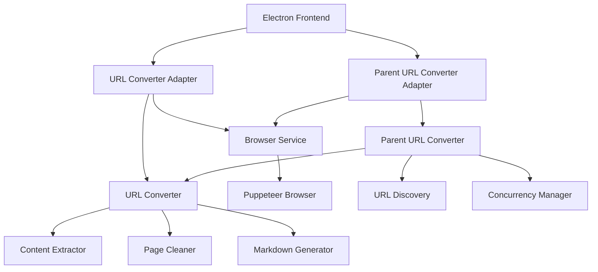

# Web Scraping Functionality Specification

## Overview
The web scraping functionality in the Electron app is designed to convert web content into Markdown format for Obsidian. It supports both single-page and multi-page (parent URL) conversions with robust error handling and content processing.

## Architecture



## Key Components

### 1. Adapter Layer
- **URL Converter Adapter**
  - Bridges Electron main process with backend converter
  - Handles cookie consent dialogs
  - Manages browser page lifecycle
  - Provides debug screenshots
  - Uses modern browser headers and settings

- **Parent URL Converter Adapter**
  - Extends single URL functionality for batch processing
  - Configures concurrency and rate limiting
  - Manages shared browser instances
  - Handles statistics and progress tracking

### 2. Core Conversion Components

#### Single URL Processing
- **Content Extraction**
  - Semantic content detection using prioritized selectors:
    ```javascript
    const selectors = [
      'main',
      'article',
      '[role="main"]',
      '.content',
      '#content',
      '.article',
      '.post-content',
      '.main-content',
      '.markdown-body',
      '.documentation',
      '.docs-content',
      '.article-content',
      '.post-body',
      '.entry-content',
      '.blog-post',
      '.page-content',
      'div[class*="content"]',
      'div[class*="article"]',
      'div[class*="post"]',
      '.container main',
      '.wrapper main',
      '.layout main',
      '#main-content',
      '#primary'
    ]
    ```
  - Dynamic content handling
  - Metadata extraction
  - Image processing and downloading

- **Page Cleaning**
  - Overlay removal
  - Cookie dialog handling with intelligent retry
  - Dynamic content waiting with timeout
  - Content validation and fallback options

#### Batch URL Processing
- **Configuration Options**
  ```javascript
  {
    concurrentLimit: 30,
    waitBetweenRequests: 500,
    maxDepth: 3,
    maxPages: 100,
    includeImages: true,
    includeMeta: true,
    handleDynamicContent: true,
    waitForContent: true,
    maxWaitTime: 45000
  }
  ```
- Rate limiting with intelligent retry logic
- Request throttling with random delays
- Real-time progress tracking and statistics

### 3. Browser Management
- Shared browser instance pool for resource efficiency
- Intelligent page lifecycle management
- Automatic resource cleanup
- Debug screenshot capture for troubleshooting
- Cookie consent and overlay handling with retries

### 4. Error Handling
- Graceful degradation with fallback content
- Intelligent retry mechanism for transient failures:
  ```javascript
  {
    retry: {
      limit: 3,
      methods: ['GET', 'HEAD'],
      statusCodes: [408, 413, 429, 500, 502, 503, 504, 520, 521, 522, 523, 524],
      errorCodes: [
        'ETIMEDOUT',
        'ECONNRESET',
        'EADDRINUSE',
        'ECONNREFUSED',
        'EPIPE',
        'ENOTFOUND',
        'ENETUNREACH',
        'EAI_AGAIN'
      ]
    }
  }
  ```
- Detailed error reporting with stack traces
- Debug screenshots for failure analysis
- Fallback content generation for partial failures

## Implementation Features

### 1. Content Discovery
- **Semantic HTML Analysis**
  - Prioritized element selection
  - Content relevance scoring
  - Main content identification
  - Dynamic content detection

- **Content Quality Checks**
  - Minimum content length validation
  - Content-to-noise ratio analysis
  - Image quality assessment
  - Link validity checking

### 2. Rate Limiting
- **Request Management**
  ```javascript
  {
    timeout: {
      lookup: 3000,    // DNS lookup timeout
      connect: 5000,   // TCP connection timeout
      secureConnect: 5000, // TLS handshake timeout
      socket: 30000,   // Socket inactivity timeout
      send: 30000,     // Time to send request
      response: 30000  // Time to receive response headers
    }
  }
  ```
- Intelligent retry backoff
- Concurrent request limiting
- Domain-specific rate limiting

### 3. Output Generation
- **Markdown Generation**
  - Clean formatting
  - Image asset management
  - Proper link handling
  - Metadata inclusion

- **File Organization**
  ```
  output/
  ├── single-pages/
  │   └── page-title/
  │       ├── index.md
  │       └── assets/
  └── batch-conversions/
      └── domain-name_YYYY-MM-DD/
          ├── index.md
          ├── page1.md
          ├── page2.md
          └── assets/
  ```

## Performance Considerations

### 1. Resource Management
- **Memory Optimization**
  - Browser instance pooling
  - Automatic resource cleanup
  - Memory usage monitoring
  - Page lifecycle management

- **Concurrency Control**
  - Adaptive concurrent page limits
  - Resource-aware throttling
  - Queue management
  - Progress tracking

### 2. Optimization Strategies
- **Request Optimization**
  - Browser cache utilization
  - Request header optimization
  - Connection pooling
  - DNS caching

- **Content Processing**
  - Streaming content processing
  - Incremental markdown generation
  - Asynchronous image processing
  - Parallel asset downloading

## Security Features

### 1. Browser Security
- Sandboxed browser instances
- Content Security Policy enforcement
- Strict CORS compliance
- Safe resource loading

### 2. Request Security
- URL validation and sanitization
- Rate limiting per domain
- User agent rotation
- Secure header management

### 3. Output Security
- Path traversal prevention
- Safe file naming
- Permission enforcement
- Asset validation

## Integration Points

### 1. Frontend Integration
- Progress reporting through IPC
- Error notifications
- Configuration management
- File selection dialogs

### 2. System Integration
- Native file system access
- System notifications
- Resource monitoring
- Crash recovery

## Error Cases and Recovery

### 1. Network Errors
- Connection timeouts
- DNS failures
- SSL/TLS errors
- Rate limiting responses

### 2. Content Errors
- Invalid HTML
- Missing content
- Broken images
- JavaScript errors

### 3. Resource Errors
- Memory limits
- Disk space
- CPU constraints
- Browser crashes

## Testing Considerations

### 1. Unit Tests
- Content extraction
- URL parsing
- Error handling
- Markdown generation

### 2. Integration Tests
- Browser management
- File system operations
- Concurrent processing
- Error recovery

### 3. Performance Tests
- Memory usage
- CPU utilization
- Disk I/O
- Network behavior

## Future Improvements

### 1. Content Extraction
- Machine learning-based content detection
- Improved image quality analysis
- Better handling of dynamic content
- Support for more content types

### 2. Performance
- Worker thread implementation
- Improved caching
- Better resource management
- Optimized concurrent processing

### 3. Browser Management
- Browser pool optimization
- Improved error recovery
- Better resource cleanup
- Enhanced debugging capabilities
